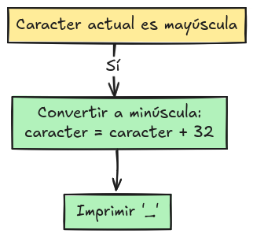
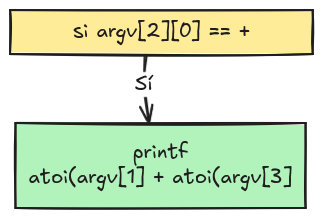
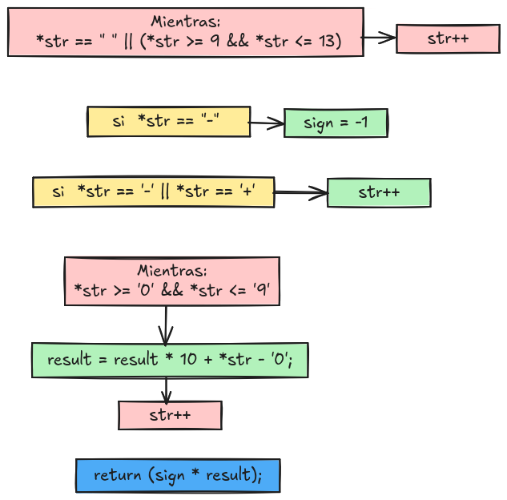
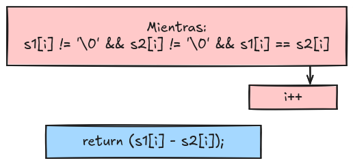

# Exam Rank 02

## alpha_mirror

--------------------------------------------------------------------------------
**'a'** se convierte en **'z'**

**'Z'** se convierte en **'A'**

**'d'** se convierte en **'w'**

**'M'** se convierte en **'N'**

<a href="#">

## camel_to_snake

<a href="#">

## do_op

Allowed functions: atoi, printf, write

<a href="#">

## ft_atoi

<a href="#">

## ft_strcmp

<a href="#">

