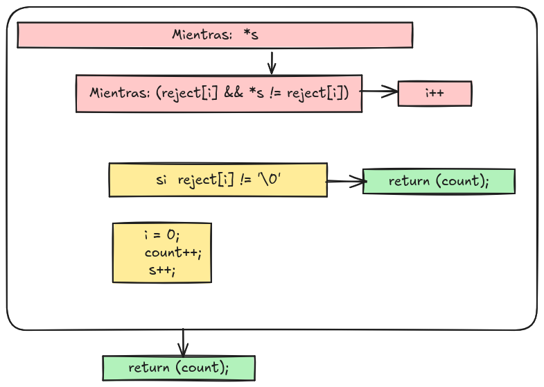
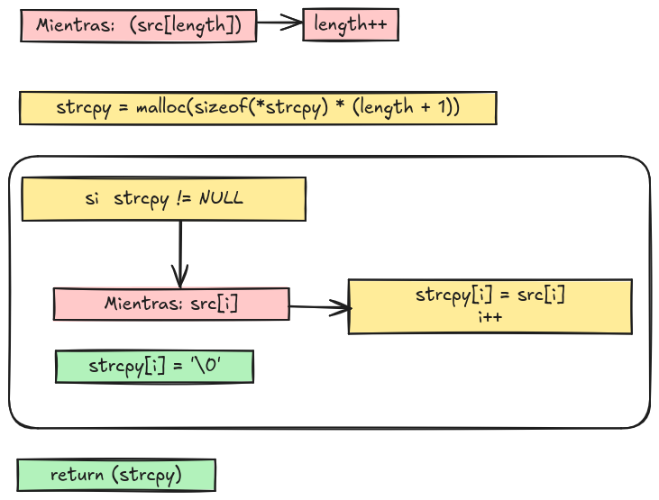
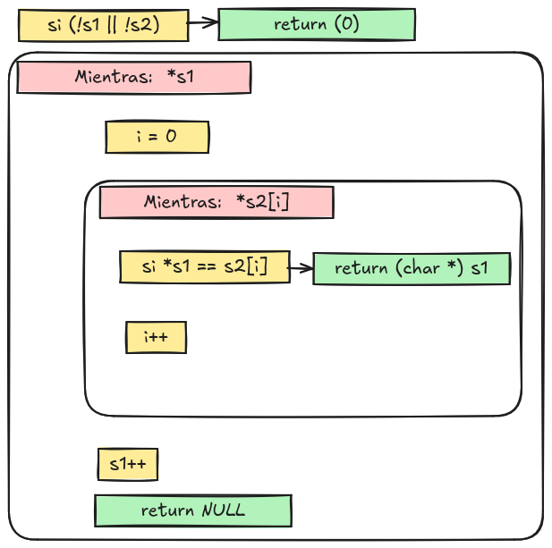
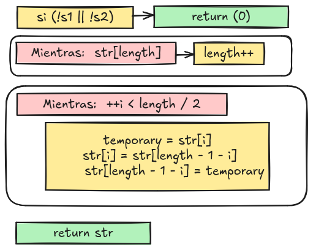

# Exam Rank 02 ( Spoiler )

## alpha_mirror

--------------------------------------------------------------------------------
**'a'** se convierte en **'z'**

**'Z'** se convierte en **'A'**

**'d'** se convierte en **'w'**

**'M'** se convierte en **'N'**

<a href="#">

## camel_to_snake

<a href="#">

## do_op

Allowed functions: atoi, printf, write

<a href="#">

## ft_atoi

<a href="#">

## ft_strcmp

int    ft_strcmp(char *s1, char *s2);

<a href="#">

## ft_strcspn

size_t	ft_strcspn(const char *s, const char *reject);

<a href="#">

## ft_strdup

char	*ft_strdup(char *src)

<a href="#">

## ft_strpbrk

char	*ft_strpbrk(const char *s1, const char *s2);

<a href="#">

## ft_strrev

char    *ft_strrev(char *str);

<a href="#">

