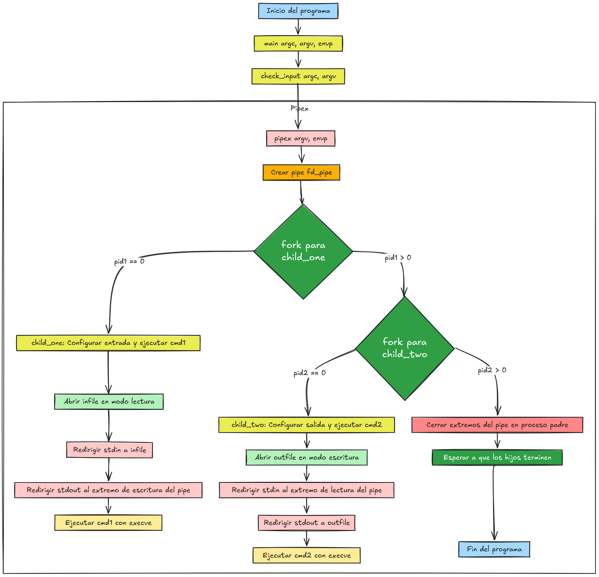

<div align="center">

<a href="#"></a>

</div>

# pipex

Este proyecto reproduce el comportamiento de las tuberías (`|`) y redirecciones de entrada/salida de la shell utilizando C. El objetivo es implementar un programa que ejecute dos comandos en secuencia, pasando la salida del primero como entrada al segundo, y redirigiendo la entrada y salida a archivos específicos.

---

## Flujo de Trabajo

El programa `pipex` se ejecuta de la siguiente manera:

```bash
./pipex infile cmd1 cmd2 outfile
```

Esto equivale a la siguiente línea en la shell:

```bash
< infile cmd1 | cmd2 > outfile
```

---

<p align="center" width="100%"><a href="#"></a></p>

## Funciones Clave

| **Función**       | **Descripción**                                                                 |
|-------------------|---------------------------------------------------------------------------------|
| **`pipe()`**      | Crea un canal de comunicación entre dos procesos (lectura y escritura).         |
| **`fork()`**      | Crea un proceso hijo para ejecutar comandos en paralelo.                        |
| **`dup2()`**      | Redirige la entrada/salida estándar a otros descriptores de archivo.            |
| **`execve()`**    | Ejecuta un comando reemplazando el proceso actual.                              |
| **`open()`**      | Abre archivos para lectura o escritura.                                         |
| **`close()`**     | Cierra descriptores de archivo para liberar recursos.                           |
| **`wait()`**      | Espera a que los procesos hijos terminen su ejecución.                          |

---

## Flujo de Ejecución

1. **Abrir el archivo de entrada (`infile`)**:
   - Se abre en modo lectura y se redirige a la entrada estándar (`stdin`) del primer comando (`cmd1`).

2. **Crear una tubería (`pipe`)**:
   - Se crea un canal de comunicación entre `cmd1` y `cmd2`.

3. **Redirigir la salida de `cmd1`**:
   - La salida estándar (`stdout`) de `cmd1` se redirige al extremo de escritura del pipe.

4. **Redirigir la entrada de `cmd2`**:
   - La entrada estándar (`stdin`) de `cmd2` se redirige al extremo de lectura del pipe.

5. **Abrir el archivo de salida (`outfile`)**:
   - Se abre en modo escritura y se redirige a la salida estándar (`stdout`) de `cmd2`.

---

## Diagrama de Flujo

<p align="center" width="100%">
  <a href="#">
    
  </a>
</p>

---

## Obtención del `PATH`

Para ejecutar comandos, es necesario encontrar la ruta completa del binario correspondiente. Esto se hace utilizando la variable de entorno `PATH`, que contiene una lista de directorios donde se buscan los ejecutables.

### Proceso de Búsqueda del `PATH`:

1. **Obtener la variable de entorno `PATH`**:
   - Se accede a la variable `PATH` desde el entorno del proceso.

2. **Dividir `PATH` en directorios**:
   - La variable `PATH` es una cadena de directorios separados por `:`.

3. **Buscar el comando en cada directorio**:
   - Se concatena cada directorio con el nombre del comando y se verifica si el archivo existe y es ejecutable.

4. **Devolver la ruta completa**:
   - Si se encuentra el comando, se devuelve su ruta completa para usarla con `execve`.

---

## Ejemplo de Ejecución

### Entrada:
```bash
./pipex input.txt "grep hello" "wc -l" output.txt
```

### Equivalente en Shell:
```bash
< input.txt grep hello | wc -l > output.txt
```

### Proceso:
1. **Abrir `input.txt`**:
   - Se redirige a `stdin` de `grep hello`.

2. **Crear tubería**:
   - Se crea un pipe para conectar `grep hello` y `wc -l`.

3. **Redirigir salida de `grep hello`**:
   - La salida de `grep hello` se envía al pipe.

4. **Redirigir entrada de `wc -l`**:
   - La entrada de `wc -l` se toma del pipe.

5. **Abrir `output.txt`**:
   - La salida de `wc -l` se redirige a `output.txt`.

---

## Problemas Comunes

1. **Cierre incorrecto de descriptores**:
   - Si no se cierran correctamente los extremos del pipe, puede causar bloqueos o fugas de recursos.

2. **Permisos de archivos**:
   - Es importante verificar que los archivos de entrada y salida tengan los permisos adecuados (`access()`).

3. **Manejo de errores**:
   - Usar `perror()` para depurar errores en llamadas al sistema como `fork()`, `execve()`, y `pipe()`.

---

## Funciones Autorizadas

- **`open`**, **`close`**, **`read`**, **`write`**, **`malloc`**, **`free`**, **`perror`**, **`strerror`**, **`access`**, **`dup`**, **`dup2`**, **`execve`**, **`exit`**, **`fork`**, **`pipe`**, **`unlink`**, **`wait`**, **`waitpid`**.
- **`ft_printf`** o equivalente personalizado.

---

## Referencias

- [Documentación de `pipe()`](https://www.cs.buap.mx/~hilario_sm/slide/SO-1/Pipe.pdf)
- [Documentación de `execve()`](https://man7.org/linux/man-pages/man2/execve.2.html)

--- 
