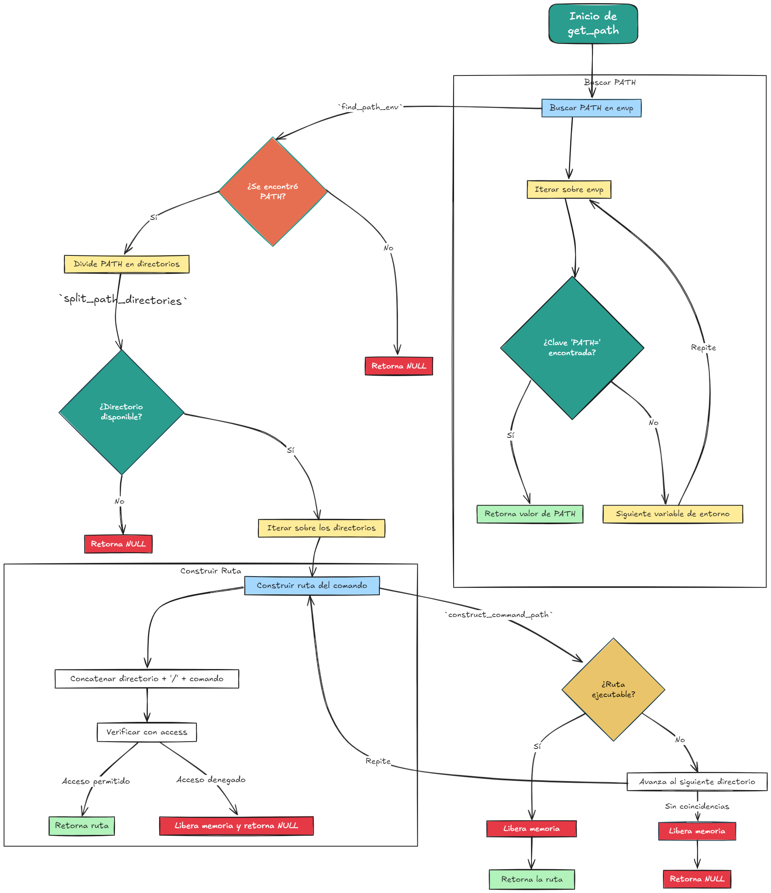

# pipex

-El proyecto pipex  es un desafío en el que se reproduce el comportamiento de las tuberías `|` y redirecciones de entrada/salida de la shell usando C.

# Símbolo |

- Redirige el output del comando de la izquierda al input del comando de la derecha, reproduciendo el comportamiento del comando `|` en la shell, usando C.

 - La ejecución es de la siguiente forma: `./pipex infile cmd1 cmd2 outfile`, y se comporta como la línea en la shell:  `< infile cmd1 | cmd2 > outfile`.

---

## RESOLVIENDO DUDAS:

Flujos en la Terminal

- En un sistema UNIX (como Linux o macOS), los procesos se comunican a través de lo que se llama **flujos estándar**. Hay tres flujos principales:

## 1- STDIN (Standard Input):

- Fuente predeterminada la entrada estándar. Por defecto, es el **TECLADO**
- Pudes cargar datos tambien desde **ARCHIVOS** (con redirección <)
- o cargar esos datos desde la **Salida** de **OTROS COMANDOS** como (**pipes |**)

## 2- STDOUT (Standard Output):

- **PANTALLA** del Terminal (predeterminado)
- **ARCHIVOS** (con redirección > o >>)
- Entrada de **OTROS COMANDOS** (pipes |)


## 3- STDERR (Standard Error):
- Es el flujo de error estándar, utilizado para imprimir mensajes de error, también redirigible.
- **Pantalla** del Terminal (por defecto).
- **Archivos** (con redirección 2> o 2>>).
- **Combinación** de stderr y stdout (con &> o 2>&1).
- **Redirección a /dev/null** (descartar los errores).
- **Archivos especiales** de dispositivos en /dev (como /dev/tty, /dev/console, etc.).
- **Archivos de registro** del sistema (logs).
- Redirección a **otros procesos** o programas (a través de pipes o comandos).
- Entrada en **programas gráficos** o **interfaces interactivas.**


# El flujo básico para dos comandos sería:

    - Abrir el archivo de entrada [infile] y redirigirlo al stdin (standar input)
    - Crear una tubería entre cmd1 y cmd2.
    - Redirigir la salida de cmd1 al extremo de escritura del pipe.
    - Redirigir la entrada de cmd2 al extremo de lectura del pipe.
    - Abrir el archivo de salida [outfile] y redirigirlo al stdout (standar output)

###  **Teoría de fondo — `pipe()`, `fork()`, `dup2()` y `execve()`**

- **`pipe()`**: Crea un canal de comunicación entre dos extremos (en este caso, dos descriptores de archivo). El primer extremo (`end[0]`) se utiliza para leer, y el segundo (`end[1]`) para escribir. Esto permite que un proceso hijo escriba datos en el pipe, y el proceso padre los lea.
- **`fork()`**: Divide el proceso principal en dos procesos (uno hijo y uno padre). Devuelve 0 al proceso hijo y un número mayor que 0 al proceso padre.
- **`dup2()`**: Permite redirigir la entrada y salida estándar a otros descriptores de archivo, por ejemplo, redirigir la salida estándar de un proceso a la entrada de otro.
- **`execve()`**: Ejecuta un comando en el sistema, permitiendo que el proceso cargue y ejecute el binario del comando.

La estructura de la función `pipex` es la siguiente:
- El archivo de entrada (`infile`) se establece como la entrada estándar del primer comando (`cmd1`).
- El comando `cmd1` escribe su salida en el pipe, que luego se pasa al segundo comando (`cmd2`).
- El archivo de salida (`outfile`) recibe la salida del segundo comando.


<p align="center" width="100%"><a href="#"></a></p>


---

### **1. Abrir el archivo de entrada (`infile`) y redirigirlo al `stdin`**
- El archivo de entrada se abre en modo lectura.
- El descriptor del archivo se conecta a la entrada estándar (`stdin`) del proceso que ejecutará el primer comando. Esto asegura que el comando pueda leer los datos del archivo en lugar de esperar entrada del teclado.
- Se hace redirigiendo `stdin` al descriptor del archivo usando una llamada al sistema.

---

### **2. Crear una tubería entre `cmd1` y `cmd2`**
- Una tubería es un canal de comunicación entre procesos, compuesto por dos extremos:
  - Un extremo para **escribir** datos.
  - Otro extremo para **leer** los datos escritos.
- La función `pipe()` crea este canal de comunicación.
- Este canal se usará para enviar la salida del primer comando (`cmd1`) como entrada para el segundo comando (`cmd2`).

---

### **3. Redirigir la salida de `cmd1` al extremo de escritura del pipe**
- Se redirige la salida estándar (`stdout`) del proceso que ejecuta el primer comando hacia el extremo de escritura del pipe.
- Esto asegura que cualquier salida producida por `cmd1` se envíe al pipe en lugar de aparecer en la pantalla o un archivo.

---

### **4. Redirigir la entrada de `cmd2` al extremo de lectura del pipe**
- Se conecta el extremo de lectura del pipe a la entrada estándar (`stdin`) del proceso que ejecutará el segundo comando.
- Esto permite que `cmd2` reciba como entrada los datos que el primer comando escribió en el pipe.

---

### **5. Abrir el archivo de salida (`outfile`) y redirigirlo al `stdout`**
- El archivo de salida se abre en modo escritura. Si no existe, se crea. Si ya existe, puede sobrescribirse o añadirse al final según el símbolo utilizado (`>` o `>>`).
- El descriptor del archivo se conecta a la salida estándar (`stdout`) del proceso que ejecuta el segundo comando.
- Esto asegura que cualquier salida producida por `cmd2` se escriba en el archivo de salida en lugar de aparecer en la pantalla.

---

Este flujo asegura que los datos pasen correctamente desde el archivo de entrada al primer comando, luego a través del pipe hacia el segundo comando, y finalmente al archivo de salida. Si hay más comandos, el flujo se encadena repitiendo los pasos de las tuberías.


 ## Funciones autorizadas para el proyecto:

 • `open`, `close`, `read`, `write`, `malloc`, `free`, `perror`, `strerror`, `access`, `dup`, `dup2`, `execve`, `exit`, `fork`, `pipe`, `unlink`, `wait`, `waitpid`

• `ft_printf` y cualquier equivalente que TÚ hayas programado.

# A parte de pipe() y fork() otra función a destacar execve
```
#include <unistd.h>

       int execve (const char *filename, const char *argv [], const char *envp[]);
```

`execve()`  ejecuta  el  programa  indicado por `filename`

`argv`  es un array de cadenas de argumentos pasados al nuevo programa.

`envp` es un array de cadenas, convencionalmente de la forma `clave=valor`, que se pasan  como  entorno  al  nuevo programa.

<p align="center" width="100%"><a href="#"></a></p>


## Diagrama de flujo de obtención de path

- Aparte de la logica y estructura de nuestro programa pipex, tenemos una subrutina importante que es la obtención de `path` o ruta, para alimentar la función `execve`
- La variable de entorno `PATH` en Unix/Linux es una lista de directorios (carpetas) que contienen los ejecutables que el sistema puede encontrar y ejecutar directamente desde la línea de comandos, sin necesidad de especificar su ruta completa.

<p align="center" width="100%"><a href="#"></a></p>


###  **Problemas comunes encontrados**
- **Cierre incorrecto de extremos del pipe**: Si uno de los extremos del pipe no se cierra correctamente, el proceso en espera no terminará correctamente.
- **Uso de `perror("Error")` para depuración**: Se recomienda usar `perror` para verificar qué está fallando en el programa, especialmente después de llamadas a `fork()` y `execve()`.
- **Derechos de acceso a archivos**: Se debe manejar correctamente los permisos de los archivos cuando se abren con `open()` y asegurarse de que sean legibles y escribibles.

---

1. **Funciones esenciales de UNIX:**
   - **`dup2(2)`**: Redirige descriptores de archivo.
   - **`access(2)`**: Verifica permisos de acceso a archivos.
   - **`execve(2)`**: Ejecuta un programa reemplazando el proceso actual.
   - **`fork(2)`**: Crea un proceso hijo.
   - **`pipe(8)`**: Crea canales unidireccionales para comunicación entre procesos.
   - **`unlink(1)`**: Elimina archivos del sistema.
   - **`wait(2)`**: Suspende el proceso padre hasta que el hijo termine.


[links:]( https://www.cs.buap.mx/~hilario_sm/slide/SO-1/Pipe.pdf)
