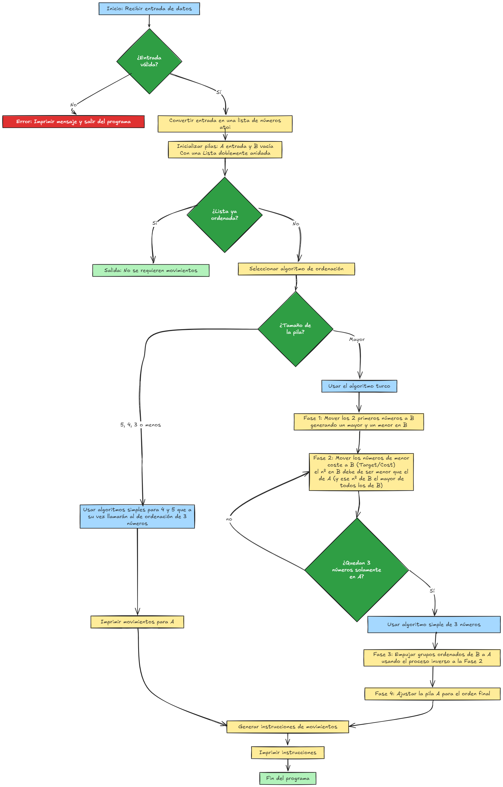

 [](https://github.com/fran-byte/Cursus-42-Madrid)

<div align="center">

<a href="#"></a>

</div>

# push_swap

Este proyecto implementa un algoritmo para ordenar una lista de números utilizando dos pilas (A y B) y un conjunto limitado de operaciones. El objetivo es ordenar los números en la pila A con el menor número de movimientos posible.

---

## Estructura del Proyecto

| **Archivo**           | **Descripción**                                                                 |
|-----------------------|---------------------------------------------------------------------------------|
| **`push_swap.c`**     | Contiene la función principal (`main`) que controla el flujo del programa.      |
| **`push_swap.h`**     | Archivo de cabecera con prototipos de funciones y declaraciones compartidas.    |
| **`init_stack.c`**    | Inicializa las pilas A y B con los números de entrada.                          |
| **`sort_up_to_five.c`** | Implementa el algoritmo para ordenar pilas de hasta 5 números.                 |
| **`sort_large.c`**    | Implementa el algoritmo para ordenar pilas con más de 5 números.                |
| **`operations.c`**    | Contiene las operaciones básicas como `swap`, `push`, `rotate` y `reverse rotate`. |


<p align="center" width="100%"><a href="#"></a></p>

---

## Instrucciones Básicas

| **Instrucción** | **Descripción**                                                                 |
|-----------------|---------------------------------------------------------------------------------|
| **sa**          | Intercambia los dos elementos en la cima de la pila A.                          |
| **sb**          | Intercambia los dos elementos en la cima de la pila B.                          |
| **ss**          | Aplica `sa` y `sb` simultáneamente.                                             |
| **pa**          | Toma el elemento superior de la pila B y lo coloca en la cima de la pila A.     |
| **pb**          | Toma el elemento superior de la pila A y lo coloca en la cima de la pila B.     |
| **ra**          | Rota todos los elementos de la pila A una posición hacia arriba.                |
| **rb**          | Rota todos los elementos de la pila B una posición hacia arriba.                |
| **rr**          | Aplica `ra` y `rb` simultáneamente.                                             |
| **rra**         | Rota todos los elementos de la pila A una posición hacia abajo.                 |
| **rrb**         | Rota todos los elementos de la pila B una posición hacia abajo.                 |
| **rrr**         | Aplica `rra` y `rrb` simultáneamente.                                           |

---

## Algoritmo de Ordenación

El algoritmo utilizado se divide en tres fases principales:

### **Fase 1: Mover números de A a B**
1. **Preparación inicial:**
   - Empuja los primeros dos números de A a B sin ningún cálculo ni orden.
2. **Criterios para mover nodos de A a B:**
   - Cada número en A necesita un "nodo objetivo" en B, que es el número más pequeño en B que sea mayor que el número que estás empujando.
   - Si no hay ningún número mayor en B, el nodo objetivo será el número más grande en B.
3. **Cálculo del costo de inserción:**
   - Para cada número en A, calcula las operaciones necesarias para llevar el número a la cima de A y su nodo objetivo a la cima de B.
4. **Seleccionar el nodo más barato:**
   - Encuentra el número en A con el costo de empuje más bajo y muévelo a B.
5. **Repite el proceso:**
   - Continúa empujando números de A a B hasta que solo queden tres números en A.

### **Fase 2: Ordenar los tres números restantes en A**
1. **Algoritmo de tres números:**
   - Si los números en A no están en orden ascendente:
     - Encuentra el número más grande y colócalo en la parte inferior usando rotaciones.
     - Intercambia los dos números superiores si es necesario para que queden en orden ascendente.

### **Fase 3: Mover números de B a A**
1. **Preparación del nodo objetivo en A:**
   - Cada número en B necesita un "nodo objetivo" en A, que es el número más grande en A que sea menor que el número que estás empujando.
   - Si no hay ningún número menor en A, el nodo objetivo será el número más pequeño en A.
2. **Cálculo del costo de inserción:**
   - Para cada número en B, calcula las operaciones necesarias para llevar el número a la cima de B y su nodo objetivo a la cima de A.
3. **Seleccionar el nodo más barato:**
   - Encuentra el número en B con el costo de empuje más bajo y muévelo a A.
4. **Repite el proceso:**
   - Continúa moviendo números de B a A hasta que B esté vacío.

### **Fase final: Ajustar el número más pequeño en A**
- Una vez que todos los números estén en A, encuentra el número más pequeño.
- Si no está en la cima de A, usa rotaciones (`ra` o `rra`) para llevarlo a la cima.

---

## Ejemplo de Ejecución

### **Pila A Inicial:**
```
./push_swap 2 7 5 4 3 6 1
```

```
A   B   (TOP)
2
7
5
4
3
6
1
```

### **Fase 1: Mover números de A a B**
1. **Mover el primer número (2) de A a B:**
   - El número **2** es el primero en la pila A y se mueve directamente a B.

```
A   B
7  [2]
5
4
3
6
1
```

2. **Mover el siguiente número (7) de A a B:**
   - El número **7** es el segundo número en moverse directamente a B.

```
A   B
5  [7]
4   2
3
6
1
```

3. **Continuar moviendo números de A a B hasta que solo queden tres números en A.**

### **Fase 2: Ordenar los tres números restantes en A**
1. **Algoritmo de tres números:**
   - Ordena los tres números restantes en A.

```
A   B
1   4
3   2
6   7
     5
```

### **Fase 3: Mover números de B a A**
1. **Mover números de B a A siguiendo el algoritmo de costo mínimo.**

### **Fase final: Ajustar el número más pequeño en A**
- Ajusta el número más pequeño en A para que esté en la cima.

```
A   B
1
2
3
4
5
6
7
```

