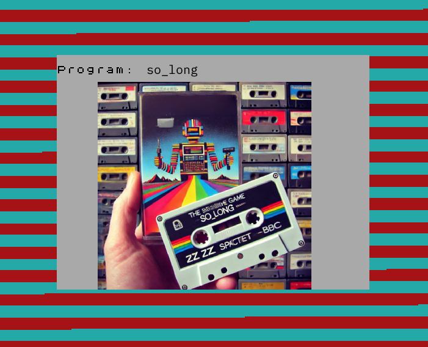
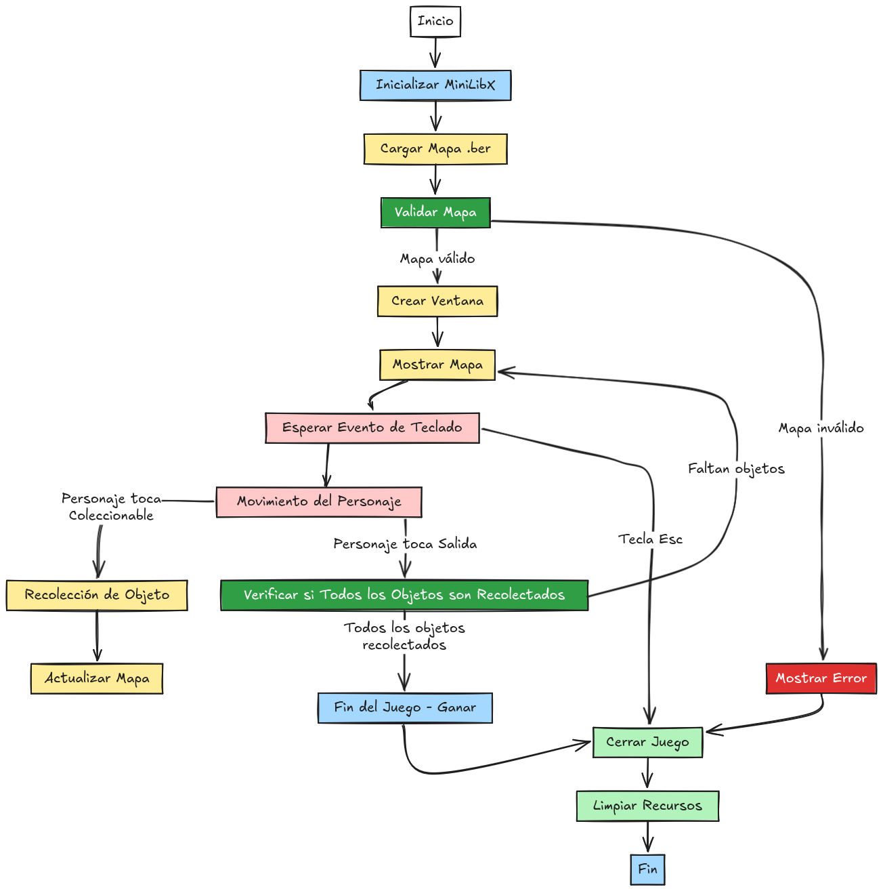
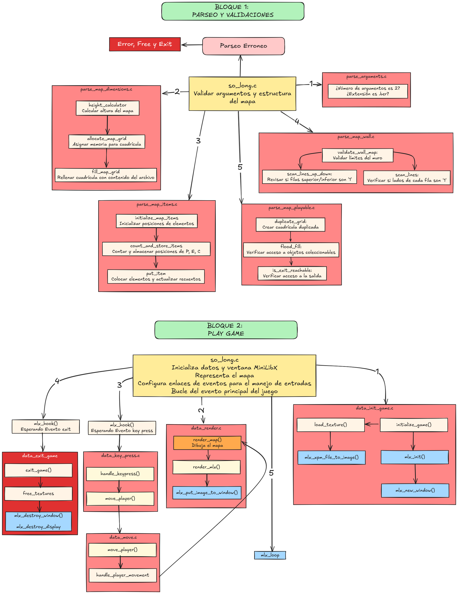

# so_long

Es un proyecto introductorio en la creación de videojuegos 2D simples utilizando gráficos básicos con la biblioteca **MiniLibX**. El objetivo principal es la familiarización con la manipulación de gráficos, eventos del teclado y la creación de mapas, mientras se aplican principios de programación estructurada.

<p align="center" width="100%"><a href="#"></a></p>

### Resumen del proyecto:
1. **Objetivo**: Crear un pequeño juego en 2D donde un personaje se mueve por un mapa recolectando objetos, alcanzando un punto de salida para ganar.
2. **Elementos principales**:
   - **Mapa**: El juego utiliza un mapa representado por un archivo `.ber` (un archivo de texto con una representación en formato rectangular). Este mapa debe contener:
     - Un personaje jugable (`P`).
     - Una salida (`E`).
     - Al menos un coleccionable (`C`).
     - Paredes (`1`) y espacio vacío (`0`).
   - **Interacciones**: El jugador debe mover al personaje con el teclado para recolectar todos los coleccionables antes de llegar a la salida.
3. **Requisitos técnicos**:
   - El mapa debe ser validado para cumplir ciertas reglas (ser rectangular, rodeado de paredes, y con al menos un camino válido hacia la salida).
   - Se debe usar **MiniLibX** para renderizar gráficos básicos.
   - La gestión de eventos como presionar teclas o cerrar la ventana debe implementarse correctamente.
4. **Aprendizajes clave**:
   - Manipulación de gráficos 2D.
   - Gestión de entradas del usuario y eventos.
   - Validación y parsing de datos.
   - Organización de un proyecto en C.

<p align="center" width="100%"><a href="#"></a></p>  

# Organización general de archivos y funciones de mi proyecto:

<p align="center" width="100%">
  <a href="../../img/milestone_2/so_long_esquema.png" target="_blank">
    
  </a>
</p>
# MiniLibX:

**MiniLibX** (Mini Library X) es una biblioteca gráfica diseñada por y para la comunidad de la escuela 42. Es un entorno liviano y simplificado que permite trabajar con gráficos 2D y eventos en el lenguaje de programación C.

---

### **Características Principales**
1. **Interfaz Simple**: MiniLibX proporciona una API minimalista para crear ventanas, manejar gráficos y capturar eventos.
2. **Compatibilidad Limitada**: Está diseñada para funcionar exclusivamente en entornos Unix-like (macOS y Linux) y utiliza dependencias como X11 en Linux y OpenGL para macOS.
3. **Gráficos Básicos**: Soporta operaciones elementales como dibujar píxeles, líneas, formas simples y manejar imágenes.
4. **Gestión de Eventos**: Ofrece herramientas para capturar y manejar interacciones del usuario, como entradas de teclado y ratón.
5. **Uso Educativo**: No es una biblioteca estándar en la industria, pero es ideal para introducirte en los conceptos gráficos.

---

### **Componentes y Funcionalidades**

#### **1. Inicialización**
La base de cualquier aplicación con MiniLibX comienza con la inicialización del entorno gráfico. Esto establece una conexión con el sistema gráfico subyacente, como **X11** en Linux o **OpenGL** en macOS.

- **Funciones principales**:
  - `mlx_init()`:
    - Inicializa MiniLibX y devuelve un puntero a la conexión gráfica.
    - Es obligatorio llamar a esta función antes de cualquier otra operación.
  - `mlx_new_window()`:
    - Crea una nueva ventana gráfica con un tamaño especificado.
    - Permite asignarle un título visible en la barra de la ventana.

  **Ejemplo**:
  ```c
  void *mlx_ptr = mlx_init(); // Inicialización
  void *win_ptr = mlx_new_window(mlx_ptr, 800, 600, "Ventana de Ejemplo");
  ```

---

#### **2. Colores**
MiniLibX usa colores en formato hexadecimal RGB (8 bits por canal). Esto permite definir colores personalizados para dibujar en la ventana o en imágenes.

- **Formato de color**: `0xRRGGBB`
  - Ejemplo:
    - `0xFFFFFF` → Blanco.
    - `0x000000` → Negro.
    - `0xFF0000` → Rojo.
    - `0x00FF00` → Verde.
    - `0x0000FF` → Azul.

- **Función principal**:
  - `mlx_pixel_put()`:
    - Dibuja un píxel individual en las coordenadas `(x, y)` de la ventana.
    - Requiere especificar el color en formato hexadecimal.

  **Ejemplo**:
  ```c
  mlx_pixel_put(mlx_ptr, win_ptr, 100, 100, 0x00FF00); // Dibuja un píxel verde en (100, 100)
  ```

---

#### **3. Dibujo de Gráficos**
MiniLibX permite dibujar formas básicas y trabajar directamente con píxeles en la ventana o en imágenes. Aunque no incluye funciones para formas complejas como círculos o polígonos, se pueden implementar usando algoritmos propios.

- **Píxeles**:
  - Se dibujan con `mlx_pixel_put()`, pero este método es lento para dibujos grandes porque opera directamente en la ventana.

- **Imágenes y mapas de bits**:
  - Crear una imagen:
    - `mlx_new_image()` crea un área en memoria donde se pueden dibujar píxeles más eficientemente.
  - Manipular la memoria de la imagen:
    - `mlx_get_data_addr()` permite acceder a los datos de la imagen como un buffer de bytes, optimizando el rendimiento al escribir píxeles directamente en memoria.

  **Ejemplo**:
  ```c
  void *img = mlx_new_image(mlx_ptr, 800, 600);
  char *data = mlx_get_data_addr(img, &bpp, &size_line, &endian);

  // Modificar píxeles manualmente
  int x = 100, y = 50;
  int color = 0xFF0000; // Rojo
  *(int *)(data + (y * size_line + x * (bpp / 8))) = color;
  ```

- **Mostrar la imagen**:
  - `mlx_put_image_to_window()` copia la imagen procesada en memoria a la ventana gráfica.

---

#### **4. Carga y Manejo de Imágenes**
MiniLibX permite cargar texturas en formato `.xpm` para su uso en el programa. Este formato es compatible con X11 y es ideal para cargar imágenes externas como sprites o fondos.

- **Funciones principales**:
  - `mlx_xpm_file_to_image()`:
    - Carga una imagen `.xpm` desde un archivo y la convierte en un formato manejable por MiniLibX.
    - Devuelve un puntero a la imagen, y también permite obtener su tamaño.
  - `mlx_put_image_to_window()`:
    - Dibuja una imagen cargada o creada en la ventana.

  **Ejemplo**:
  ```c
  void *img = mlx_xpm_file_to_image(mlx_ptr, "sprite.xpm", &width, &height);
  mlx_put_image_to_window(mlx_ptr, win_ptr, img, 100, 100); // Mostrar en la ventana
  ```

---

#### **5. Gestión de Eventos**
MiniLibX permite manejar eventos como teclas presionadas, movimientos del ratón o el cierre de la ventana. Los eventos se gestionan mediante *hooks*, que son funciones callback que se activan cuando ocurre un evento específico.

- **Eventos comunes**:
  - `2`: Presión de una tecla.
  - `3`: Soltado de una tecla.
  - `4`: Movimiento del ratón.
  - `5`: Clic del ratón.
  - `17`: Cerrar la ventana.

- **Funciones principales**:
  - `mlx_key_hook()`:
    - Maneja eventos de teclado. Llama a una función cuando una tecla es presionada.
  - `mlx_mouse_hook()`:
    - Captura eventos del ratón, como clics.
  - `mlx_hook()`:
    - Permite manejar eventos más generales, especificando el código del evento.

- **Ciclo principal**:
  - `mlx_loop()`:
    - Inicia un bucle que mantiene la ventana abierta y procesa los eventos registrados.

  **Ejemplo**:
  ```c
  int handle_keypress(int keycode, void *param)
  {
      if (keycode == 53) // Código para tecla Esc en macOS
          exit(0);
      return (0);
  }

  mlx_key_hook(win_ptr, handle_keypress, NULL); // Asocia la función a eventos de teclado
  mlx_loop(mlx_ptr); // Inicia el ciclo principal
  ```

---

#### **6. Cierre Limpio**
Es fundamental liberar los recursos utilizados para evitar fugas de memoria. MiniLibX ofrece funciones para cerrar ventanas y destruir imágenes.

- **Funciones principales**:
  - `mlx_destroy_window()`:
    - Cierra y libera la memoria de una ventana.
  - `mlx_destroy_image()`:
    - Libera la memoria asociada a una imagen creada o cargada.

  **Ejemplo**:
  ```c
  mlx_destroy_window(mlx_ptr, win_ptr);
  mlx_destroy_image(mlx_ptr, img_ptr);
  ```

---

#### **7. Textos**
MiniLibX también permite renderizar texto simple en la ventana con la función `mlx_string_put()`.

- **Función principal**:
  - `mlx_string_put()`:
    - Dibuja un texto en las coordenadas `(x, y)` de la ventana.
    - Usa colores en formato hexadecimal.

  **Ejemplo**:
  ```c
  mlx_string_put(mlx_ptr, win_ptr, 50, 50, 0xFFFFFF, "Hola, MiniLibX!");
  ```

---

### **Resumen de Componentes**


| Componente  | Función Principal                      | Uso                                           |
|-------------|----------------------------------------|-----------------------------------------------|
| Ventanas    | `mlx_new_window()`                    | Crear y manejar ventanas gráficas            |
| Píxeles     | `mlx_pixel_put()`                     | Dibujar píxeles individuales                 |
| Imágenes    | `mlx_new_image()` y `mlx_put_image()` | Crear, manipular y mostrar imágenes          |
| Texturas    | `mlx_xpm_file_to_image()`             | Cargar texturas desde archivos `.xpm`        |
| Eventos     | `mlx_key_hook()` y `mlx_hook()`       | Capturar teclas, ratón y otros eventos       |
| Textos      | `mlx_string_put()`                    | Renderizar texto básico                      |
| Cierre      | `mlx_destroy_window()`                | Liberar recursos al finalizar el programa    |


```
