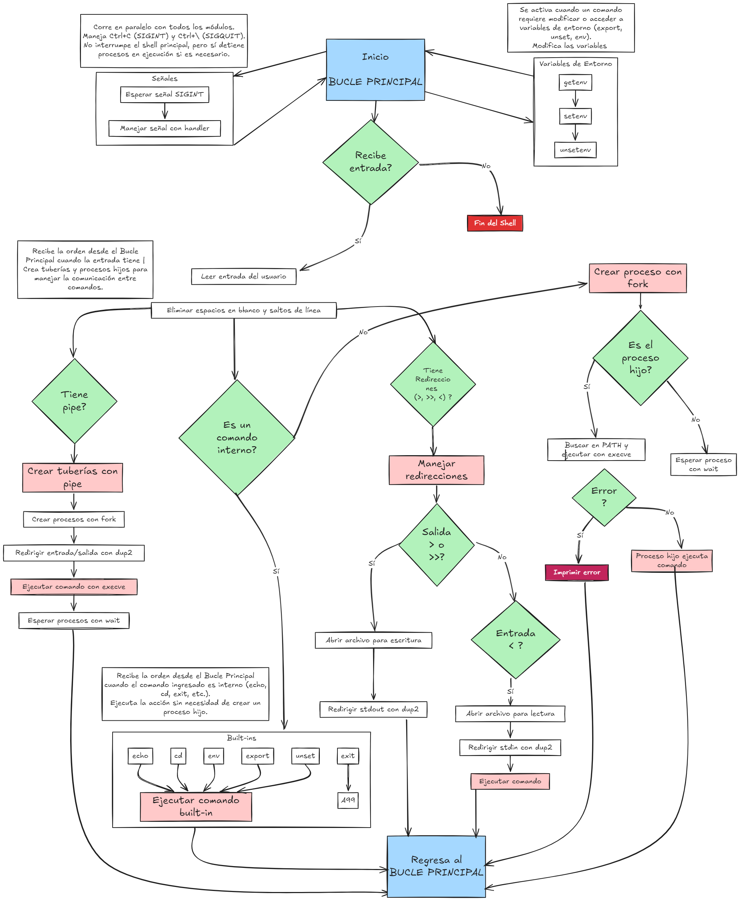

 

# Proyecto Minishell (en fase de borrador)

- Este proyecto consiste en crear nuestra propia `shell`, nuestro propio interprete de comandos,
  una versión reducida de la **Shell de Unix**

  ## Que debe de hacer nuestra shell:
  - Lo primero es mostrar nuestro prompt: **minishell>**
  - Leerá una entrada por la terminal con `readline()` y deberá ser capaz interpretar los comandos
    introducidos en ella (ls, echo, cat, etc.) y guardarlos en el historial.
  - Debe manejar pipes (|), redirecciones (<, >, >>, <<).
  - Debe implementar algunos built-ins (cd, pwd, exit, export, etc.).
  - Debe capturar señales (Ctrl+C, Ctrl+D, Ctrl+\).
 

La minishell debe manejar variables de entorno. Esto incluye poder obtener, establecer y eliminar variables de entorno.

