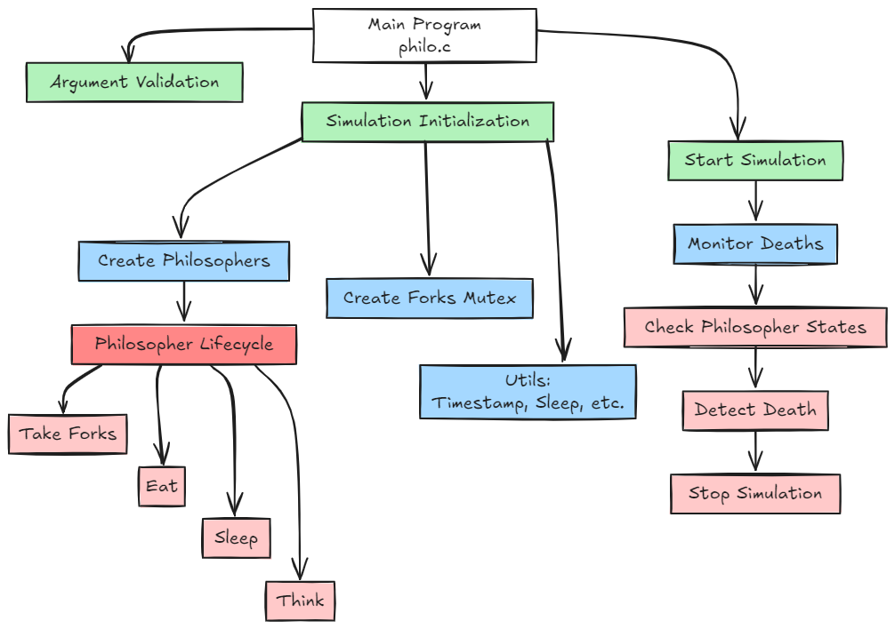

# Introducción al Proyecto Philosophers

- Este proyecto se centra en la programación concurrente. Te reta a resolver un problema clásico de la programación, diseñado para enseñar cómo gestionar recursos compartidos entre múltiples procesos de forma eficiente y sincronizada. Los conceptos clave de este proyecto son la concurrencia, la sincronización y el uso de **hilos** y **mutexes**.

- En el problema que abordarás, un grupo de filósofos debe alternar entre tres actividades esenciales: **comer, pensar y dormir**. Sin embargo, su acceso a los recursos necesarios para comer está limitado, y la solución del problema radica en garantizar que todos los filósofos puedan completar sus ciclos sin interferencias o bloqueos.

## 1. El problema de los filósofos comensales

- Planteado inicialmente por **Edsger Dijkstra**, es una metáfora clásica de la programación concurrente. Donde Varios procesos (los filósofos) deben coordinarse para acceder a recursos compartidos limitados (los tenedores), evitando conflictos como interbloqueos o inanición.

## 1.1 Planteamiento del problema
La premisa es la siguiente podríamos iniciar por ejemplo con un nº de filósofos:

- Cinco filósofos están sentados en una mesa redonda.
  
- Cada filósofo alterna entre tres actividades: **comer** ,**pensar** y **dormir**.
  
- En el centro de la mesa hay cinco tenedores, uno colocado entre cada par de filósofos.
  
- Para que un filósofo pueda comer, necesita dos tenedores: el de su izquierda y el de su derecha.
  
- Una vez que termina de comer, el filósofo deja los tenedores disponibles, pasa a pensar durante un tiempo y, finalmente, se toma un descanso para dormir antes de repetir el ciclo.
  
- La principal dificultad radica en que los recursos compartidos (los tenedores) son limitados. Si los filósofos no se sincronizan adecuadamente, pueden surgir varios problemas:

## 1.2 Problemas principales
**Interbloqueo o deadlock:**

- Esto ocurre cuando cada filósofo toma un tenedor y espera indefinidamente por el otro. En este estado, ningún filósofo puede avanzar, y el sistema queda completamente bloqueado.

**Inanición o starvation:**

- En este caso, uno o más filósofos no logran comer porque otros monopolizan constantemente los recursos, dejando a algunos sin acceso. Este problema se debe a la falta de un mecanismo justo de reparto de los recursos.

**Condiciones de carrera o race conditions:**

- Este problema aparece cuando varios filósofos intentan acceder simultáneamente al mismo recurso, lo que puede generar inconsistencias en el estado de los tenedores y errores impredecibles en el programa.

## 2. Fundamentos teóricos

- El proyecto te introduce a dos conceptos fundamentales en la programación concurrente: los hilos y los mutexes. Estas herramientas te permitirán simular las actividades de los filósofos y gestionar el acceso a los recursos compartidos de forma segura.

## 2.1 Hilos (Threads)

- Un hilo es la unidad más pequeña de ejecución dentro de un programa. A diferencia de los procesos tradicionales, que tienen su propia memoria independiente, los hilos comparten la memoria y los recursos del proceso principal, lo que los hace más ligeros y rápidos. Sin embargo, esta característica también introduce riesgos, ya que un hilo puede modificar datos compartidos por otros hilos, causando errores si no se gestionan adecuadamente.

- En este proyecto, cada filósofo será representado por un hilo independiente. Esto significa que los filósofos podrán comer, pensar y dormir de manera simultánea. Sin embargo, como todos comparten los tenedores, será necesario coordinar sus acciones para evitar conflictos.

- En C, trabajarás con la biblioteca **POSIX Threads (pthreads)**, que proporciona funciones esenciales para crear y gestionar hilos. Algunas de las funciones clave que usarás incluyen:

- **pthread_create:** Crea un nuevo hilo y asigna una función para que este ejecute.
  
- **pthread_join:** Permite que el programa principal espere a que un hilo termine antes de continuar. Esto es útil para asegurar que todos los filósofos completen sus ciclos correctamente.
 
- **pthread_exit:** Finaliza un hilo de forma segura, liberando los recursos asociados.
  
- Además, necesitarás simular el tiempo que los filósofos tardan en realizar cada actividad (comer, pensar y dormir). Para ello, puedes usar funciones como **usleep** para introducir pausas en los hilos.

**Contexto de la concurrencia**

- Aunque los hilos parecen ejecutarse simultáneamente, en realidad el sistema operativo alterna entre ellos, asignándoles pequeños intervalos de tiempo en la CPU. Este comportamiento es conocido como multitarea y puede causar resultados inesperados si los hilos no están sincronizados correctamente. Por esta razón, la sincronización es un aspecto crucial del proyecto.

## 2.2 Exclusión mutua y mutexes

- La exclusión mutua es un mecanismo que asegura que solo un hilo pueda acceder a un recurso compartido en un momento dado. Esto es fundamental para evitar conflictos en programas concurrentes.

- En el proyecto, implementarás exclusión mutua utilizando mutexes, que son estructuras de sincronización diseñadas para proteger recursos compartidos. Un mutex actúa como un “candado” que un hilo debe bloquear antes de acceder a un recurso. Una vez que termina de usar el recurso, debe liberar el mutex para que otros hilos puedan acceder.

- En el contexto del problema de los filósofos, cada tenedor estará asociado a un mutex. Esto significa que:

- Antes de comer, un filósofo debe bloquear los mutexes de los dos tenedores que necesita.
- Después de comer, debe liberar ambos mutexes para que otros filósofos puedan usarlos.
- Las funciones clave para trabajar con mutexes en pthreads son:

- **pthread_mutex_init:** Inicializa un mutex antes de usarlo.
- **pthread_mutex_lock:** Bloquea un mutex, permitiendo que un hilo acceda al recurso que protege. Si el mutex ya está bloqueado, el hilo esperará hasta que esté disponible.
- **pthread_mutex_unlock:** Libera un mutex bloqueado, permitiendo que otros hilos accedan al recurso.
- **pthread_mutex_destroy:** Libera los recursos asociados a un mutex cuando ya no se necesita.
  
- El uso adecuado de mutexes es esencial para evitar problemas como interbloqueos y condiciones de carrera. Sin embargo, diseñar una lógica eficiente para su uso puede ser un desafío, ya que requiere anticipar todas las posibles interacciones entre los hilos.

## 3. Estrategias de solución

- Resolver el problema de los filósofos comensales implica diseñar una solución que evite los problemas de interbloqueo, inanición y condiciones de carrera. Algunas estrategias comunes incluyen:

## 3.1 Asignación ordenada de recursos
En esta estrategia, los filósofos toman los tenedores en un orden específico. Por ejemplo:

- Algunos filósofos pueden tomar primero el tenedor de la izquierda y luego el de la derecha, mientras que otros toman primero el de la derecha. Esto evita que todos intenten acceder a los mismos recursos al mismo tiempo.
  
## 3.2 Control del número de filósofos
Otra solución consiste en limitar el número de filósofos que pueden intentar comer al mismo tiempo. Esto garantiza que siempre haya suficientes tenedores disponibles para al menos un filósofo.

## 3.3 Introducción de jerarquías
Puedes asignar una jerarquía a los tenedores y forzar a los filósofos a tomarlos en un orden estricto (por ejemplo, siempre de menor a mayor). Esto elimina los ciclos en el sistema, evitando el riesgo de interbloqueo.

### **Descripción del Proyecto**
El proyecto **Philosophers** es un ejercicio clásico de programación concurrente que simula el problema de los filósofos comensales. El objetivo es gestionar la sincronización de múltiples hilos (filósofos) que comparten recursos (tenedores) para evitar condiciones de carrera y deadlocks. A continuación, te doy un resumen del proyecto basado en los archivos que has compartido:

# **Estructura de mi Proyecto**
El proyecto está dividido en varios archivos:

1. **philo.c**: Contiene la función principal (`main`) y la validación de los argumentos de entrada.
2. **philo_utils.c**: Implementa funciones utilitarias como la obtención del tiempo actual, la conversión de cadenas a números, y la función de suspensión del programa.
3. **philo_start.c**: Se encarga de la inicialización y ejecución de la simulación, incluyendo la creación de hilos y la gestión de mutex.
4. **philo_create.c**: Implementa la lógica de los filósofos, incluyendo cómo toman los tenedores, comen, duermen y piensan.
5. **philo_monitor_deaths.c**: Contiene la lógica para monitorear si algún filósofo ha muerto de hambre.
6. **philo.h**: Es el archivo de cabecera que contiene las definiciones de estructuras, constantes y prototipos de funciones.

<p align="center" width="100%"><a href="#"></a></p>

### **Funcionalidades Clave**
1. **Validación de Argumentos**:
   - El programa recibe 4 o 5 argumentos: número de filósofos, tiempo para morir, tiempo para comer, tiempo para dormir, y opcionalmente, el número de veces que cada filósofo debe comer.
   - Los argumentos deben ser números positivos, y el programa muestra un mensaje de error si no son válidos.

2. **Inicialización de la Simulación**:
   - Se inicializan los filósofos, los tenedores (mutex), y se establece el tiempo de inicio de la simulación.
   - Cada filósofo tiene un hilo asociado que ejecuta su ciclo de vida.

3. **Ciclo de Vida del Filósofo**:
   - **Tomar tenedores**: Los filósofos intentan tomar los tenedores izquierdo y derecho. Si solo hay un filósofo, se maneja como un caso especial.
   - **Comer**: Una vez que un filósofo tiene ambos tenedores, come durante un tiempo especificado.
   - **Dormir**: Después de comer, el filósofo duerme durante un tiempo especificado.
   - **Pensar**: Finalmente, el filósofo piensa antes de intentar comer nuevamente.

4. **Monitoreo de la Simulación**:
   - Un hilo monitor verifica si algún filósofo ha muerto de hambre (si ha pasado demasiado tiempo desde su última comida).
   - Si un filósofo muere, la simulación se detiene y se imprime un mensaje indicando su muerte.

5. **Sincronización**:
   - Se utilizan mutex para garantizar que solo un filósofo pueda tomar un tenedor a la vez.
   - Se utiliza un mutex para proteger la impresión de mensajes en la consola, evitando que los mensajes se solapen.

### **Funcionalidad de Monitoreo de Muertes**
El archivo **philo_monitor_deaths.c** contiene la función `monitor_deaths`, que es un hilo independiente que verifica constantemente si algún filósofo ha muerto de hambre. Aquí está el resumen de su funcionamiento:

1. **Verificación Continua**:
   - El hilo monitor revisa el tiempo transcurrido desde la última comida de cada filósofo.
   - Si el tiempo desde la última comida de un filósofo supera el tiempo permitido para morir (`time_to_die`), se considera que el filósofo ha muerto.

2. **Acción ante la Muerte**:
   - Si un filósofo muere, se imprime un mensaje indicando su muerte.
   - La simulación se detiene (`sim->is_running = 0`), y todos los hilos de los filósofos terminan su ejecución.

3. **Uso de Mutex**:
   - Se utiliza un mutex (`state_mutex`) para proteger el acceso a la variable `last_meal` de cada filósofo, evitando condiciones de carrera.

### **Casos de Prueba**
El archivo `philo_start.c` incluye varios casos /* Comentados */ de prueba para verificar el comportamiento del programa:
- **Sin muertes**: Ejemplos donde los filósofos no deberían morir.
- **Con muertes**: Ejemplos donde al menos un filósofo debería morir.
- **Errores**: Ejemplos con argumentos inválidos que deberían hacer que el programa muestre un mensaje de error y no se ejecute.

```
/*
 * Test cases for the philosophers program:
 * ./philo 5 800 200 200        no one should die
 * ./philo 5 600 150 150        no one should die ***
 * ./philo 4 410 200 200        no one should die
 * ./philo 100 800 200 200      no one should die
 * ./philo 105 800 200 200      no one should die
 * ./philo 200 800 200 200      no one should die
 *
 * ./philo 1 800 200 200        a philo should die
 * ./philo 4 310 200 100        a philo should die
 * ./philo 4 200 205 200        a philo should die
 *
 * ./philo -5 600 200 200       should error and not run (no crashing)
 * ./philo 4 -5 200 200         should error and not run (no crashing)
 * ./philo 4 600 -5 200         should error and not run (no crashing)
 * ./philo 4 600 200 -5         should error and not run (no crashing)
 * ./philo 4 600 200 200 -5     should error and not run (no crashing)
 *
 * Valgrind command to check for memory leaks:
 * valgrind --leak-check=full --track-origins=yes --show-leak-kinds=all ./philo
 */
```


### **Uso de Valgrind**
Como siempre se recomienda usar **Valgrind** para verificar fugas de memoria y errores de manejo de memoria durante la ejecución del programa.

