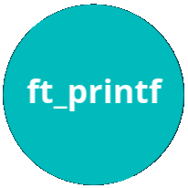
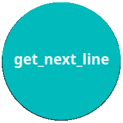

     

 

<i><b>42 Madrid</b> Campus de programación gratuito y revolucionario.</i>

<i>Open 24/7, permite aprender a tu ritmo con una duración media de tres años.</i>

👉     [*Recursos*](documentation/)     👈

<h2 align="center" width=100%">- Proyectos Cursus 42 Madrid -</h2>

<h2 align="center" style="color: #FF5733; width: 100%;">- Proyectos Cursus 42 Madrid -</h2>

<h1 align="center"><a href="0">0</a></h1>

<a href="0/">

<h1 align="center"><a href="milestone_1">Milestone 1</a></h1>

<a href="milestone_1/born2beroot"><a/>

<h1 align="center"><a href="#">Milestone 2</a></h1>

