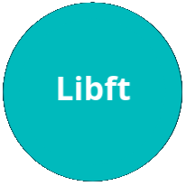
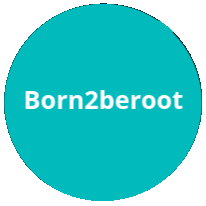
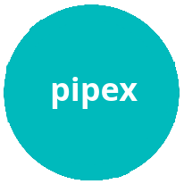

     

<i>Campus de programación gratuito. Open 24/7 </i>

    

<h2 align="center" width="100%"><b>-&nbsp;&nbsp;P&nbsp;&nbsp;R&nbsp;&nbsp;O&nbsp;&nbsp;Y&nbsp;&nbsp;E&nbsp;&nbsp;C&nbsp;&nbsp;T&nbsp;&nbsp;O&nbsp;&nbsp;S&nbsp;&nbsp;-</b></h2>

<h2 align="center">Milestone 0</h2>

<a href="42_Madrid/0/">

<h2 align="center">Milestone 1</h2>

<a href="42_Madrid/milestone_1/born2beroot"><a/>

<h2 align="center">Milestone 2</h2>

<a href="42_Madrid/milestone_2/push_swap/"><a/><a href="42_Madrid/milestone_2/pipex/"><a/><a/><a href="42_Madrid/milestone_2/so_long/"><a/><a href="42_Madrid/milestone_2/exam_rank_02/"><a/>

