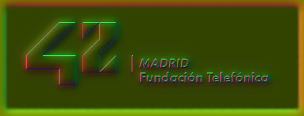

     

 

<i><b>42 Madrid</b> Campus de programación gratuito y revolucionario.</i>

<i>Open 24/7, permite aprender a tu ritmo con una duración media de tres años.</i>

👉     [*Recursos*](documentation/)     👈

Proyectos del Cursus 42 Madrid

## [0](0)
## [MileStone 1](milestone_1)

