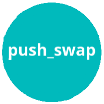

     

 

<i><b>42 Madrid</b> Campus de programación gratuito y revolucionario.</i>

<i>Open 24/7, permite aprender a tu ritmo con una duración media de tres años.</i>

<h2 align="center" width=100%">- Cursus 42 Madrid -</h2>

<h1 align="center">Milestone 0</h1>

<a href="0/">

<h1 align="center">Milestone 1</h1>

<a href="milestone_1/born2beroot"><a/>

<h1 align="center">Milestone 2</h1>

<a href="milestone_2/push_swap/"><a/>

