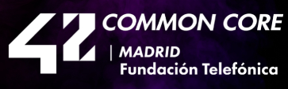

:point_right:**[Spanish Version](README.md)**

[42 Madrid](https://www.42madrid.com/) is a free and revolutionary programming campus. Open 24/7, it allows you to learn at your own pace with an average duration of three years. This repository contains my course projects.

## [0](0/README_en.md)
## [MileStone 1](milestone_1)
## Notes

**-[1.MAKEFILES](documentation/makefile.md)**

**-[2.HEADERS](documentation/header.md)**
