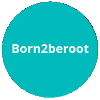

<h1 align="center" width="100%">Recursos para empezar Milestone 1</h1>

<i>Teniendo ya asumido el proyecto de la libft

Aunque todavía con algunas lagunas afrontamos los siguientes 3 proyectos

  

1. [Debugger de terminal lldb](lldb_debugger.md)

2. [Fugas de memoria](memory_leaks.md)

