# Born2BeRoot en Debian

# Tutorial  (Solamente Parte Obligatoria)

# ¿ Por qué trabajar sobre una máquina virtual (VM) ?

➤ Una máquina virtual es una máquina que se encuentra dentro de una máquina anfitriona.

➤ Se comportará de la misma manera que cualquier otra máquina; tiene un sistema operativo y algunas aplicaciones.

➤ Existen varias ventajas de tener una máquina virtual:

	- Económica
	- Ahorro de espacio físico (almacenamiento)
	- Menor mantenimiento que una máquina física
	- Respaldo de datos simplificado
	- Mayor seguridad

➤ Creamos la máquina virtual y la imagen de Debian en mi directorio sgoinfre.

➤ **Sgoinfre** es un servidor accesible desde la red de la Escuela 42 y disponible desde cada computadora. Es un servidor de documentos donde tienes un directorio con tu nombre de usuario al que solo tú puedes acceder.

➤ En cada computadora también hay una carpeta llamada **goinfre**. Esta carpeta te permite almacenar algunos documentos. Es diferente en cada computadora y es más grande que el almacenamiento de tu sesión.

➤ Si colocas tu máquina virtual en el servidor **sgoinfre**, puedes cambiar de computadora durante tu proyecto. Si la colocas en la carpeta **goinfre**, tienes que quedarte en la misma computadora todo el tiempo.

## 1- Descargando ISO de Debian e instalando Virtual Box

➤ Crearemos una máquina virtual vacía. Es como si estuvieras configurando una computadora desde cero.

➤ Lins de descarga:

:point_right: [Click](https://www.debian.org/distrib/index.es.html) URL  ISO Debian

:point_right: [Click](https://www.virtualbox.org/) URL  Virtual Box

## 2- Instalación VM de Debian

1. Abrirmos VirtualBox y clikeamos en **Nueva**


2. Pondremos nombre de nuestra máquina y ubicación, debe de ir la carpeta **sgoinfre**, para no quedaremos sin espacio.

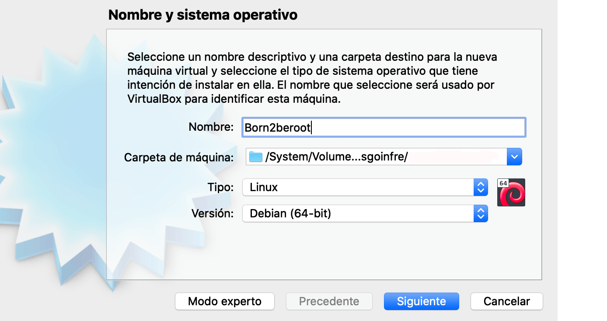

3. Seleccionamos la cantidad de memoria RAM que reservaremos para la máquina.


4. **Disco duro**, seleccionamos la segunda opción para así crear un disco duro **virtual ahora**.


5. Tipo de **archivo**, escogemos la primera opción **VDI**, ya que nos hemos descargado una imagen de disco.


6. Seleccionamos  **Reservado dinámicamente** ya que nos irá reservando memoria en la máquina real según la utilicemos hasta límite máximo disponible en la VM.


7. Después de elegir la cantidad de memoria recomendada **12 GB** o **30 Gb** si hacemos bonus, y le damos a **crear**.


8. Ahora nos vamos a **Configuración** / **Almacenamiento** / **Controlador IDE** / **Vacío** y nos vamos a **unidad óptica** / y sobre **IDE secundario maestro** clickeamos en el icono del **disco** y elegimos **Seleccionar un archivo de disco**...


9. Seleccionaremos la ISO que tenemos y le damos a **Abrir** / **Aceptar**.

10.  Ya podemos **Iniciar** nuestra máquina virtual.

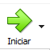


## 3- Instalación Debian en nuestra VM

➤ En esta parte, configurarás los primeros elementos de tu máquina. Harás lo siguiente:

 - Seleccionar el idioma, la zona horaria y el país en el que funcionará tu máquina.
 - Crear un nombre de host (tu_login_42) y una contraseña para tu máquina.
 - Crear un primer usuario simple (tu_login_42) y una contraseña para dicho usuario.
 - Configurar las particiones de tu máquina.

### ¿Qué es el particionamiento de disco con LVM?

El **particionamiento de disco** es la creación de una o más regiones de almacenamiento (llamadas particiones), de manera que cada región pueda gestionarse por separado.

Cada sistema operativo tiene una forma diferente de designar las particiones. En Linux (y por lo tanto en Debian o CentOS), se designan de la siguiente manera: `sdXN`, donde `X` es una letra que representa el medio y `N` es el número de la partición en el medio (por ejemplo, `sdb3` para la tercera partición del disco b).

El particionamiento ofrece muchas ventajas en términos de seguridad.

Es común reservar particiones para servicios que pueden generar un gran volumen de datos para evitar saturar las particiones del sistema.

Aquí tienes una breve lista de particiones que pueden existir (y que usamos en este proyecto):

- `/`
  Contiene el resto del árbol del sistema.

- `/boot`
  Contiene datos que se utilizan antes de que el kernel comience a ejecutar programas en modo usuario.

- `/var`
  Contiene archivos variables.

- `/tmp`
  Contiene archivos temporales.

- `/home`
  Contiene los directorios de los usuarios.

### ¿Y qué es LVM?

Puedes pensar en **LVM** (Logical Volume Manager) como "particiones dinámicas", lo que significa que puedes crear, redimensionar o eliminar particiones LVM (llamadas "volúmenes lógicos" en el lenguaje de LVM) desde la línea de comandos mientras tu sistema Linux está en funcionamiento. No es necesario reiniciar el sistema para que el kernel reconozca las particiones recién creadas o redimensionadas.

1. Versión **SIN** interfaz gráfica **Install**, (indicado por el subject)

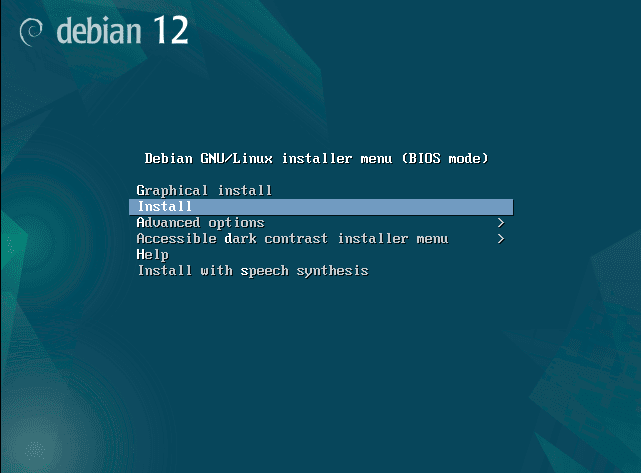

2. Seleción de idioma que usaremos para instalar y el predeterminado de nuestro sistema **English**.


3. Introducimos el País, territorio o zona. para colocar España nos vamos a **Other** / **Europe** / **Spain**.


4. Combinación lenguaje / país **Configure locales** seleccionamos **United States**.


5. Debemos seleccionar **American English** en configuración de teclado, si no habrá problemas de teclas mal enlazadas.

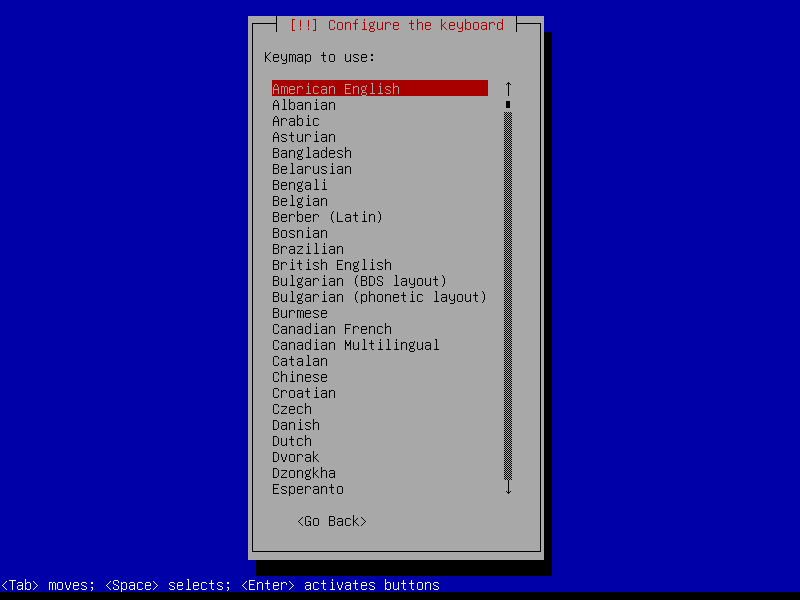

6. Nombre de **Host Name** de la máquina, será tu login seguido de 42.


7. **Domain name** apartado que dejaremos vacío, en el subject no menciona rellenarlo, y le damos a continuar .


1. Nuestra contraseña de la cuenta de administración del sistema. **Apúntala**, la usaremos. Asegurate que la has escrito correctamente, tabula hasta la opción **Show Password in Clear** dale a la barra espaciadora y podrás ver tu clave.


9. Repetimos el proceso de nuevo.

10. Nombre de nuestro nuevo usuario. tenemos que crear un usuario adicional como menciona el subject y no debe de ser el root con nuestro login, así que llamaremos **frromero** al nuevo usuario, y nos lo vuelve a pedir de nuevo.


11. Introduciremos la contraseña de nuestro nuevo usuario. repitiendolo dos veces el proceso, es importante que la guardes porque la utilizaremos.

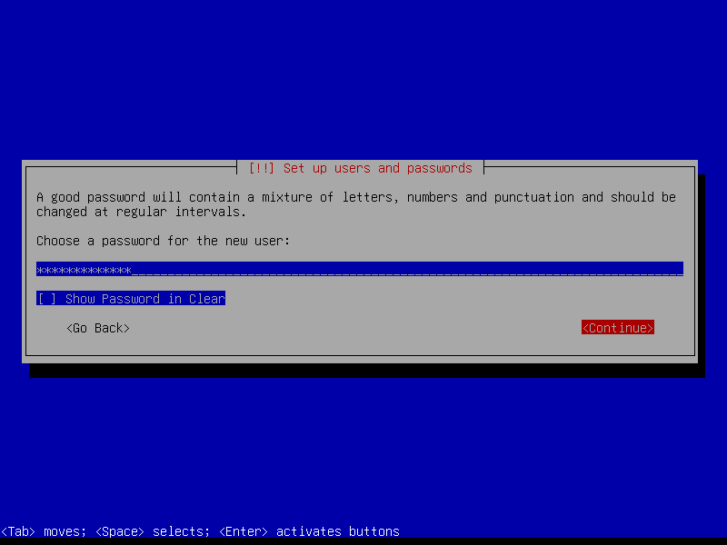

12. Colocamos la hora de nuestra localización.

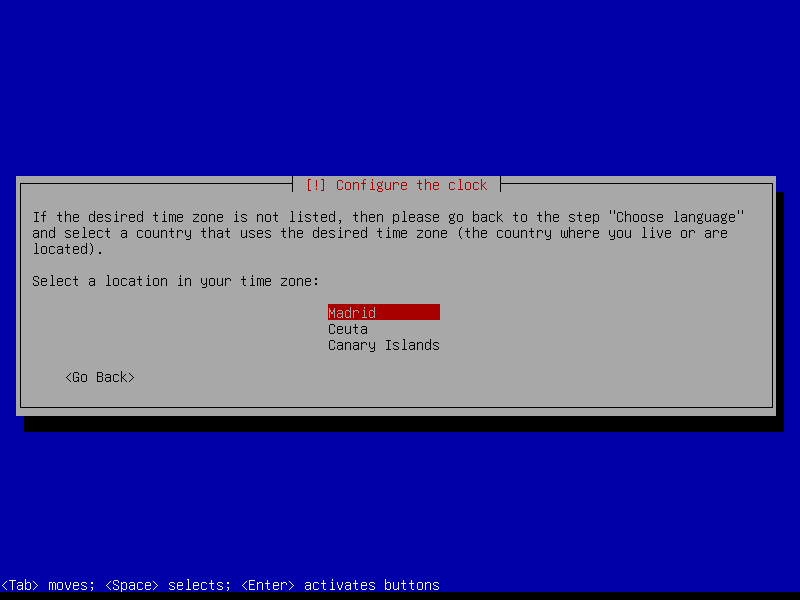

13. Selecionamos la tercera opción **Guied - use entire disk and set up encrypted LVM**, el subject nos comenta que deben ser particiones cifradas, **Manual** para el bonus (pero no te sirve este tutorial)


14. Disco en el que queremos hacer el particionado (Debe de haber solo un disco).

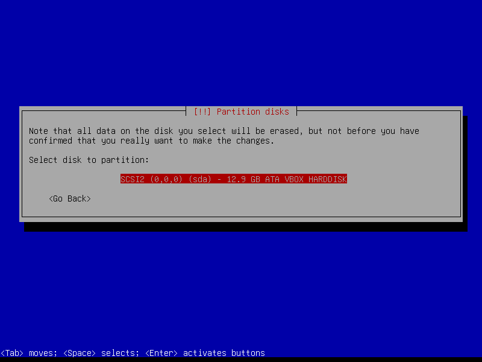

15. **Particiones**, seleccionar la segunda opción **Separate /home partition**.


16. Validamos **Yes** para guardar los cambios en el disco y configurar el gestor de volúmenes lógicos (LVM).

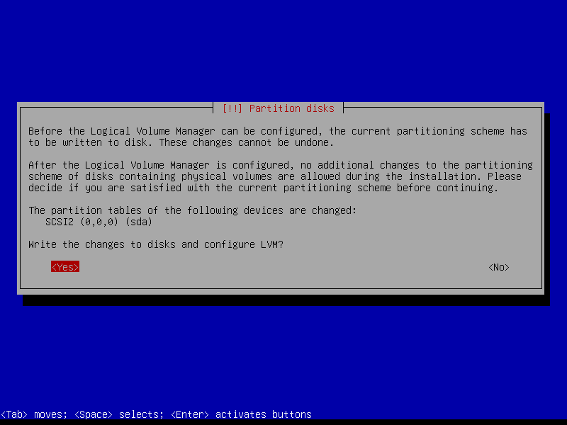

17. No es necesario borrar los datos, daremos a **Cancel** ya que lo estamos haciendo en un entrono virtual .


18. Otra contraseña, ahora será la frase de encriptación. Repites proceso, y anótala la usaremos después.


19. Colocar la cantidad de volumen que usaremos en la partición guiada. ponemos **max** o el número máximo disponible.


20. Finalizamos y escribimos los cambios, selecionamos **Finish partitioning and write changes to disk**.


21. **Yes** para continuar y confirmar los cambios en el disco.

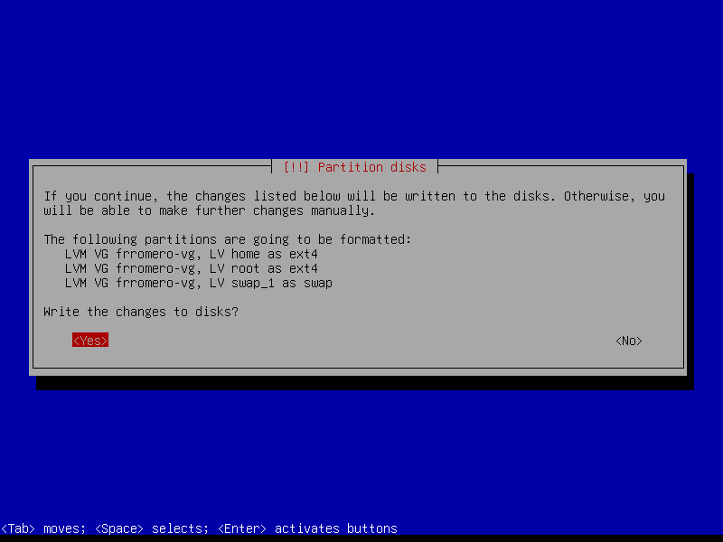

22. **No** necesitamos paquetes adicionales.

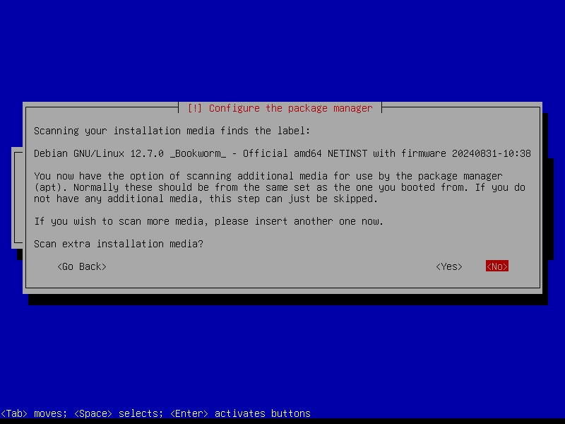

23. **Package Manager** elegimos nuestro país.

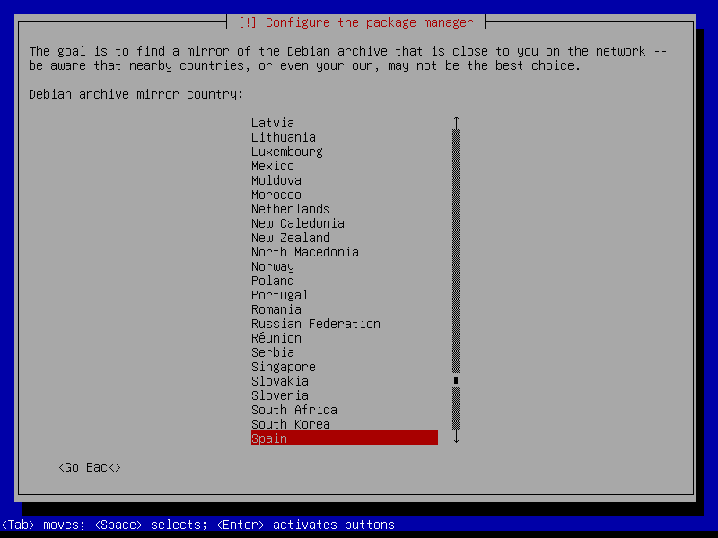

24. **Configure package manager**, elegimos la opción recomendada **deb.debian.org**

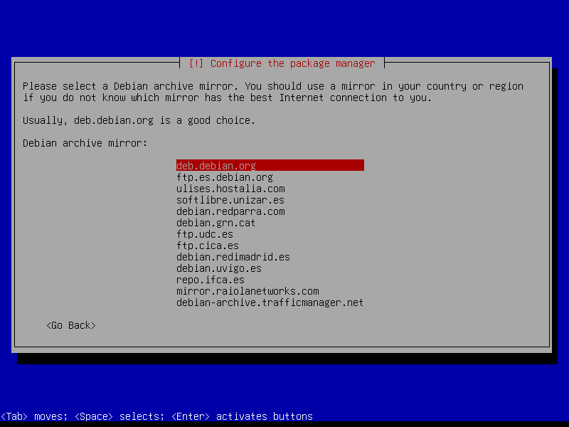

25. El proxy lo dejamos vacío y le daremos **Continue**.


26. **No** para que los developers vean nuestras estadísticas aunque sean anónimas.

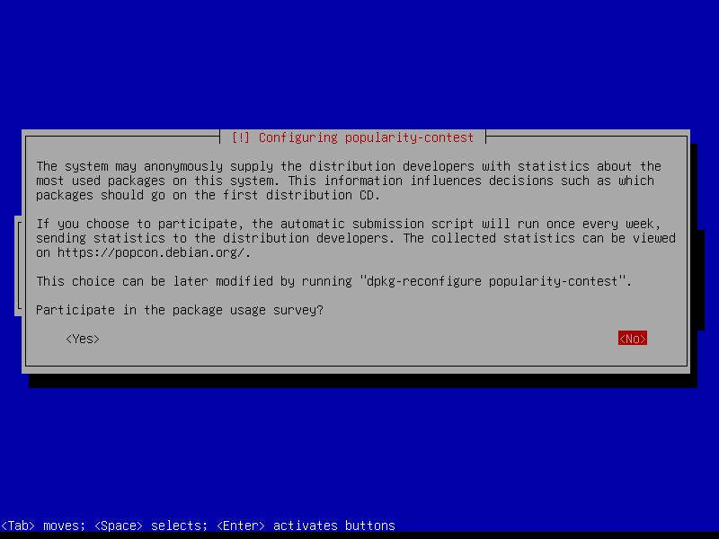

27.  Eliminamos todas las opciones de software (con barra espaciadora) y **Continue**.

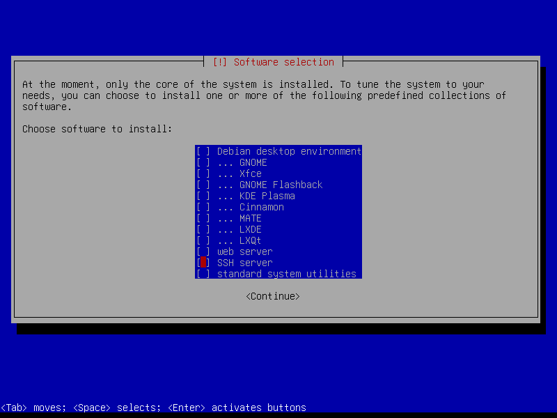

28. **Yes** para instalar **GRUB boot**.
➤ GNU GRUB (GNU GRand Unified Bootloader) es un cargador de arranque múltiple, desarrollado por el proyecto GNU que nos permite **elegir qué Sistema Operativo** arrancar de los instalados.


29. Selecionamos el dispositivo instalar del cargador de arranque **/dev/sda (ata_VBOX_HARDDISK)**.


30. **Continue** finalizar la instalación.


# 4 Configurando la máquina virtual (VM)

## aptitude
➤ Recuerda qué paquetes se solicitaron explícitamente y cuáles se instalaron solo debido a dependencias.
     y  desinstalará automáticamente los paquetes que no se solicitaron explícitamente cuando ya no sean necesarios.
## apt
➤ Solo hará exactamente lo que se le indique en la línea de comandos.

## APPArmor

➤ Es un sistema de seguridad en Linux que proporciona control de acceso obligatorio (MAC). Permite al administrador del sistema restringir las acciones que los procesos pueden realizar. Está incluido por defecto en Debian.

➤ Ejecuta aa-status para comprobar si está funcionando.

## SSH (Secure Shell)

➤ SSH significa "Secure Shell", permitirá administrar tus servidores Linux, tanto localmente, (físicamente frente a tu servidor), o remota a tus servidores para administrarlos.

## UFW (Uncomplicated Firewall)

➤ Protección de red definiendo comunicaciones permitidas o prohibidas mediante reglas. Supervisa el tráfico de red entrante y saliente y decide si bloquear o permitir dicho tráfico.

➤ Nosotrtos en este proyecto dejaremos abierto solo el puerto 4242.

## Política de Contraseñas

➤ Es un conjunto de reglas diseñadas para mejorar la seguridad alentando a los usuarios a usar contraseñas relativamente seguras y a usarlas correctamente.
(que expire cada 30 días, tenga más de 10 caracteres y no contenga secuencias lógicas, y que contenga letras mayúsculas, caracteres especiales y números).

➤ Cada usuario de tu máquina virtual deberá seguir las siguientes reglas de contraseñas:
```
    PASS_MAX_DAYS 30
    PASS_MIN_DAYS 2
    PASS_WARN_AGE 7
```

Es posible que tu usuario predeterminado no tenga estas modificaciones, por lo que deberás hacerlo manualmente.

Para ver qué parámetros de contraseña están asociados a un usuario, puedes escribir este comando:

➤ bash

➤ sudo chage -l nombre_usuario

➤ Si los valores no corresponden a los indicados, deben cambiarse manualmente de la siguiente manera:

``` bash

sudo chage -M 30 <usuario>
sudo chage -m 2 <usuario>
sudo chage -W 7 <usuario>
```
## Grupos y usuarios

➤ Linux utiliza grupos como una forma de organizar a los usuarios. Existen para simplificar la gestión de permisos de archivos y carpetas. Linux está diseñado para permitir que varios usuarios accedan al sistema al mismo tiempo, pero con permisos diferentes.


➤ **root** es el superusuario y tiene la capacidad de hacer cualquier cosa en el sistema. Para tener una capa adicional de seguridad, generalmente se usa un usuario **sudo** en lugar de **root**.

➤ Necesitarás instalar sudo. Sudo significa "superuser do". En pocas palabras, sudo le otorga al usuario designado un "superpoder" para actuar como administrador temporalmente. sudo se utiliza para dar a otro usuario acceso limitado a la cuenta de otro con el fin de realizar tareas administrativas. Permite que un usuario tenga privilegios de administrador sin iniciar sesión directamente como root.

➤Esta gestión de derechos asignados a los usuarios está contenida en el archivo **/etc/sudoers**

## Crontab

➤ **Cron** es un programa que permite a los usuarios de sistemas Unix ejecutar automáticamente scripts, comandos o software en una fecha y hora predefinidas o en un ciclo predefinido.

➤  En este proyecto tendrás que publicar un mensaje cada 10 minutos.

➤ Creas un script (en nuestro caso será el script de monitoreo que contiene toda la información) que quieras ejecutar usando cron.
Luego, escribes **sudo crontab -u root -e** para abrir crontab y agregar una regla.

La regla:

``` bash

* * * * * <ruta>/<nombre_del_programa_a_ejecutar>

Donde * * * * * significa cada minuto de cada hora de cada día de cada mes y cada día de la semana. Algunos ejemplos:

    0 * * * *: esto significa que cron se ejecutará siempre cuando los minutos sean 0 (entonces, cada hora).
    0 1 * * *: esto significa que cron se ejecutará siempre a la 1 en punto.
    * 1 * * *: esto significa que cron se ejecutará cada minuto cuando la hora sea la 1, es decir, 1:00, 1:01... hasta las 1:59.
    */10 * * * *: significa que cron se ejecutará cada 10 minutos.
```
## Signature.txt

➤ Una firma es un número identificador único para un disco duro u otro dispositivo de almacenamiento de datos. Un sistema operativo la utiliza para diferenciar entre los dispositivos de almacenamiento en tu computadora.

# INICIANDO EL SISTEMA

➤ Seleccionamos **Debian GNU/Linux**.

➤ Nos pide la contraseña de encriptación.

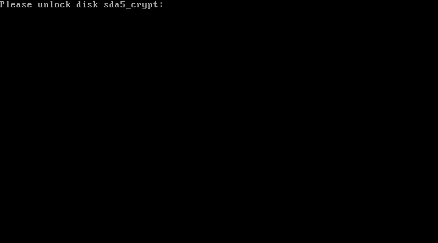

➤ Debemos introducir el usuario y contraseña que hemos creado. Usuario **frromero** y la contraseña **42Madrid13/12**

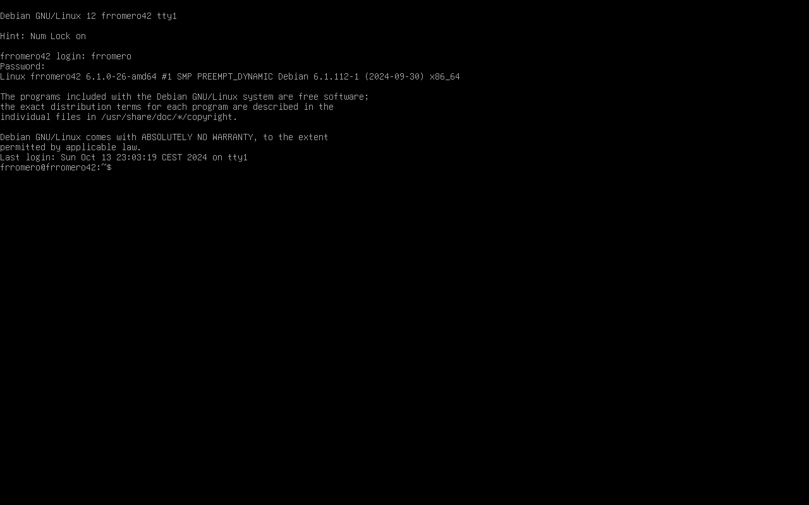

### Ya tenemos todo listo para empezar a configurar nuestra máquina virtual Debian

### 4.1 - Instalación de sudo y configuración de usuarios y grupos

- Si por algún motivo detectas algún error con tu etc/hosts
  Puedes verificar y corrigir el archivo /etc/hosts

- Asegúrate de que el archivo /etc/hosts contenga la entrada correcta para el nombre del host. Haz lo siguiente:

- Abre el archivo /etc/hosts para editarlo
Asegúrate de que haya una línea que se vea así:

```bash

nano /etc/hosts

127.0.0.1   localhost
127.0.1.1   frromero42

```

1. Instalando **sudo**, nos pasamos usuario root, ponemos **Su** en el terminal e introduciremos la contraseña, **42Madrid13/12**. Y ahora ponemos el comando **apt install sudo** para instalar los paquetes necesarios.

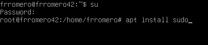

2. Reiniciamos la máquina para aplicar cambios **sudo reboot**.


3. Ahora de nuevo introducimos contraseñas de cifrado y usuario. Verifcamos la instalación en tramos de nuevo como usuario root y ponemos **sudo -V**, además de mostrarnos la versión de sudo, mostrará los argumentos pasados para configurar cuando se creó sudo y los plugins que pueden mostrar información más detallada. **sudo -V | more** para ver todo el contenido.

4. Estando en super usuario: (**su**)  crearemos un usuario con nuestro login **sudo adduser login** como ya lo habiamos hemos creado la instalación nos debe aparecer que el usuario ya existe.

5. Ahora crearemos un nuevo grupo llamado **user42**. con **sudo addgroup user42**.

 - <b>GID</b> identificador de grupo, abreviatura de Group ID.

6. Verificado de la creación correcta de grupos: **getent group nombre_grupo** o en **cat /etc/group** y veremos todos los grupos y los usuarios que hay dentro de ellos.

7. Con el comando **sudo adduser user group** incluiremos al usuario en el grupo.
   Debemos incluir al usuario en los grupos **sudo** y **user42**.

8. Después de incluirlos dentro de los grupos podemos ejecutar el comando **getent group nombre_grupo** o editar **nano /etc/group** y en los grupos **sudo** y **user42** deberá aparecer nuestro usuario.


### 4.2 - SSH Instalación y configuración

- <b>Qué es SSH?</b> Nombre de un protocolo y programa que se encarga de dar acceso remoto a un servidor por un canal seguro donde la información va cifrada.

1. Actualizamos repositorios  **sudo apt update** definidos en el archivo /etc/apt/sources.list

2. Instalando la herramienta para este protocolo SSH, **OpenSSH**. Con el comando **sudo apt install openssh-server**.


Para comprobar que se haya instalado correctamente haremos **sudo service ssh status** y nos debe aparecer active.


3. Despuésde la instalación hay ficheros que configurar. Utilizaremos [Nano](https://es.wikipedia.org/wiki/GNU_Nano),
   - Primer fichero que editaremos será **nano /etc/ssh/sshd_config**. nos vamos a **su** para tener permisos de escritura, o **sudo nano /etc/ssh/sshd_config**


4. Los comentarios de linea empiezan por **#**, las líneas a modificar hay que quitarle el comentario.
   - Líneas a modificar:

➤ #Port 22 -> Port 4242

➤ #PermitRootLogin prohibit-password -> PermitRootLogin no

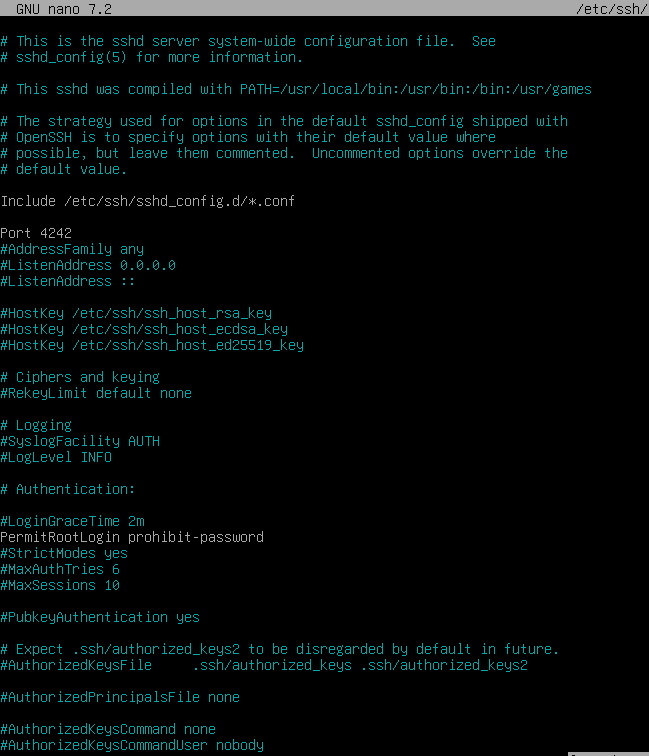

- Guardamos cambios.

5. Ahora editamos el fichero **/etc/ssh/ssh_config**.

- Editaremos la siguiente línea:

➤ #Port **22** a Port **4242**


6. Reiniciamos el servicio ssh para actualizar los cambios **sudo service ssh restart** y revisaremos los cambios con  **sudo service ssh status** y veremos la escucha del servidor debe aparecer el Puerto **4242**.

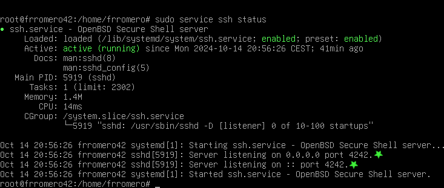


### 4-3 Instalación y configuración de UFW

- [UFW](https://es.wikipedia.org/wiki/Uncomplicated_Firewall) Es un [firewall](https://es.wikipedia.org/wiki/Cortafuegos_(inform%C3%A1tica)) el cual utiliza la línea de comandos para configurar las [iptables](https://es.wikipedia.org/wiki/Iptables) usando un pequeño número de comandos simples.

1. Instalando **UFW**, con el  comando **sudo apt install ufw**

2. Lo habilitamos con el comando **sudo ufw enable** y veremos que el firewall está activo.

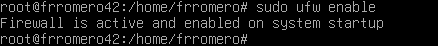

3. Nuestro firewall tinen que permitir las conexiones por el puerto 4242. Lo haremos con el comando **sudo ufw allow 4242**.


4.  Y lo comprobaremos con el comando **sudo ufw status**.


### 4-4 Configurando contraseña fuerte para sudo

1. Crearemos un fichero en la ruta **/etc/sudoers.d/** le pondremos de nombre sudo_config, almacenará la configuración de la contraseña. lo crearemos con **touch /etc/sudoers.d/sudo_config**.

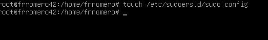

2. Hay que crear el directorio sudo en la ruta /var/log yºa que cada comando que ejecutemos con sudo, tanto el input como el output, debe quedar almacenado en ese directorio. **mkdir /var/log/sudo**.


3. Editaremos el fichero de configuracion de sudo con  **nano /etc/sudoers.d/sudo_config**.

4. Una vez estamos editando el fichero deberemos introducir los siguientes comandos para cumplir todos los requisitos que pide el subject.

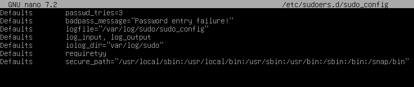

## DESGLOSANDO LOS COMANDOS

Defaults  passwd_tries=3 (nº de reintentos)

Defaults  badpass_message="Password entry failure!"

Defaults  logfile="/var/log/sudo/sudo_config" (archivos de registro de comandos sudo lanzados)

Defaults  log_input, log_output (comandos tanto imput como output quedarán registrados en el siguiente directorio)

Defaults  iolog_dir="/var/log/sudo"

Defaults  requiretty  (activar modo TTY)

Defaults  secure_path="/usr/local/sbin:/usr/local/bin:/usr/sbin:/usr/bin:/sbin:/bin:/snap/bin  (restringir los directorios utilizables por sudo)


### 4-5 Configuración de política de contraseñas fuerte

1 El primer paso será editar el fichero login.defs.


2 Una vez estemos editando el fichero, modificaremos los siguientes parámetros:

➤ PASS_MAX_DAYS 99999 -> PASS_MAX_DAYS 30

➤ PASS_MIN_DAYS 0 -> PASS_MIN_DAYS 2


PASS_MAX_DAYS: Es el tiempo de expiración de la contraseña. El número corresponde a días.

PASS_MIN_DAYS: El número mínimo de días permitido antes de modificar una contraseña.

PASS_WARN_AGE: El usuario recibirá un mensaje de aviso indicando que faltan los días especificados para que expire su contraseña.

3 Para poder seguir con la configuración debemos instalar los siguientes paquetes con este comando **sudo apt install libpam-pwquality** , acto seguido pondremos **Y** para confirmar la instalación y esperaremos a que termine.


4 Lo siguiente que debemos hacer es volver a editar un fichero y modificar algunas líneas. Haremos **nano /etc/pam.d/common-password**.


5 Después de retry=3 debemos añadir los siguientes comandos:

```
minlen=10
ucredit=-1
dcredit=-1
lcredit=-1
maxrepeat=3
reject_username
difok=7
enforce_for_root
```
➤ Así debe ser la línea


➤ Así se debe ver en el fichero


 <b>Que hace cada comando?</b>

minlen=10 ➤ La cantidad mínima de caracteres que debe contener la contraseña.

ucredit=-1 ➤ Como mínimo debe contener una letra mayúscula. Ponemos el - ya que debe contener como mínimo un carácter, si ponemos + nos referimos a como máximo esos caracteres.

dcredit=-1 ➤ Como mínimo debe contener un dígito.

lcredit=-1 ➤ Como mínimo debe contener una letra minúscula.

maxrepeat=3 ➤ No puede tener más de 3 veces seguidas el mismo carácter.

reject_username ➤ No puede contener el nombre del usuario.

difok=7 ➤  Debe tener al menos 7 caracteres que no sean parte de la antigua contraseña.

enforce_for_root ➤ Implementaremos esta política para el usuario root.

6 La política de contraseñas que acabamos de implementar afecta solo a los usuarios nuevos. Por lo tanto, es necesario actualizar las cuentas de los usuarios que fueron creadas antes de esta política para que cumplan con los nuevos requisitos de seguridad. Para comprobar si el usuario no cumple con la política haremos uso del comando **sudo chage -l username**.

Asi se veria, debemos comprobar que los dias


7 Si vemos que dicho usuario no cumple con la politica debemos modificar el numero minimo y maximo de dias entre cambios de contraseña, para ello usaremos el siguiente comando: **sudo chage -m <time> <username>** y **sudo chage -M <time> <username>**.

-m is para el numero minimo de dias y -M para el numero maximo.

Asi se deben de ver los comandos


Una vez aplicados los cambios asi se deberia ver:


### 4-6 Conectarse vía SSH 🗣

1. Para conectarnos por SSH debemos cerrar la máquina, abrir VirtualBox y darle a configuración.


2. Una vez en configuración debemos pinchar sobre el apartado de **Red**, pincharemos sobre **Avanzadas** para que así nos muestre más opciones y le daremos a **Reenvío de puertos**.


3. Pincharemos sobre el siguiente emoticono para agregar una regla de reenvío.


4. Por último, agregaremos el puerto **4242** al anfitrión y al invitado. Las IP's no son necesarias. Pincharemos sobre el botón de aceptar para que así se apliquen los cambios.


➤ Para poder conectarnos a la máquina virtual desde la real debemos abrir un terminal en la máquina real y escribir **ssh frromero@localhost -p 4242** nos pedirá la clave del usuario y una vez la introduzcamos ya nos saldrá el login en verde y eso significa que estaremos conectados.


## 5- Script

Esta es una parte muy importante del proyecto. Debes prestar atención en todo, muy importante no copiar y pegar directamente el fichero sin saber que hace cada cosa. En la evaluación debes explicar cada comando si el evaluador lo pide.

<b>Qué es un script?</b> Es una secuencia de comandos guardada en un fichero que cuando se ejecuta hará la función de cada comando.

### 5-1 Architecture

Para poder ver la arquitectura del SO y su versión de kernel utilizaremos el comando **uname -a** ( "-a" == "--all" ) que básicamente printará toda la información, excepto si el tipo de procesador es desconocido o la plataforma de hardware.


### 5-2 Núcleos físicos

Para poder mostrar el número de núcleos físicos haremos uso del fichero /proc/cpuinfo el cual  proporciona información acerca del procesador: su tipo, marca, modelo, rendimiento, etc. Usaremos el comando **grep "physical id" /proc/cpuinfo | wc -l** con el comando grep buscaremos dentro del fichero "physical id" y con wc -l contaremos las líneas del resultado de grep. Esto lo hacemos, ya que la manera de cuantificar los núcleos no es muy común. Si hay un procesador marcará 0 y si tiene más de un procesador, mostrará toda la información del procesador por separado, contando los procesadores usando la notación cero. De esta manera simplemente contaremos las líneas que hay, ya que es más cómodo cuantificarlo así.


### 5-3 Núcleos virtuales

Para poder mostrar el número de núcleos virtuales es muy parecido al anterior. Haremos uso de nuevo del fichero /proc/cpuinfo , pero en este caso, utilizaremos el comando **grep processor /proc/cpuinfo | wc -l**. El uso es prácticamente el mismo al anterior, solo que en vez de contar las líneas de "physical id" lo haremos de processor. Lo hacemos así por el mismo motivo de antes, la manera de cuantificar marca 0 si hay un procesador.


### 5-4 Memoria RAM

Para mostrar la memoria RAM haremos uso del comando **free** para así ver al momento información sobre la RAM, la parte usada, libre, reservada para otros recursos, etc. Para más info sobre el comando, pondremos free --help. Nosotros daremos uso de free --mega , ya que en el subject aparece esa unidad de medida (Megabyte). Es importante poner --mega y no -m. Con -m nos referiremos a la unidad de medida Mebibyte y no es la que especifica el subject.


Una vez hemos ejecutado este comando debemos filtrar nuestra búsqueda, ya que no necesitamos toda la información que nos aporta, lo primero que debemos mostrar es la memoria usada, para ello haremos uso del comando **awk** que lo que hace este comando es para procesar datos basados en archivos de texto, es decir, podremos utilizar los datos que nos interesen de X fichero. Por último, lo que haremos será comparar si la primera palabra de una fila es igual a "Mem:" printaremos la tercera palabra de esa fila que será la memoria usada. Todo el comando junto sería **free --mega | awk '$1 == "Mem:" {print $3}'**. En el script el valor de retorno de este comando se lo asignaremos a una variable que concatenaremos con otras variables para que todo quede igual como especifica el subject.


Para obtener la memoria total el comando es prácticamente igual al anterior, lo único que deberemos cambiar es que en vez de printar la tercera palabra de la fila queremos la segunda **free --mega | awk '$1 == "Mem:" {print $2}'**.


Por última parte debemos calcular el % de memoria usada. El comando de nuevo es parecido a los anteriores, la única modificación que haremos en la parte del printeo. Como la operación para conseguir el tanto porciento no es exacta, nos puede dar muchos decimales y en el subject solo aparecen 2 así que nosotros haremos lo mismo, por eso utilizamos **%.2f** para que así solo se muestren 2 decimales. Otra cosa que quizás no sepas es en printf para que se muestre un **%** hay que poner **%%**. Todo el comando **free --mega | awk '$1 == "Mem:" {printf("(%.2f%%)\n", $3/$2*100)}'**.


### 5-5 Memoria del disco

Para poder ver la memoria del disco ocupada y disponible utilizaremos el comando **df** que significa "disk filesystem", se utiliza para obtener un resumen completo del uso del espacio en disco. Como en el subject indica la memoria utilizada se muestra en MB, así que entonces utilizaremos el flag -m. Acto seguido haremos un grep para que solo nos muestre las líneas que contengan "/dev/" y seguidamente volveremos a hacer otro grep con el flag -v para excluir las líneas que contengan "/boot". Por último utilizaremos el comando awk y sumaremos el valor de la tercera palabra de cada línea para una vez sumadas todas las líneas printar el resultado final de la suma. El comando entero es el siguiente: **df -m | grep "/dev/" | grep -v "/boot" | awk '{memory_use += $3} END {print memory_use}'**.


Para obtener el espacio total utilizaremos un comando muy parecido. Las únicas diferencias serán que los valores que sumaremos serán los $2 en vez de $3 y la otra diferencia es que en el subject aparece el tamaño total en Gb así que como el resultado de la suma nos da el número en Mb debemos transformarlo a Gb, para ello debemos dividir el número entre 1024 y quitar los decimales.


Por último, debemos mostrar un porcentaje de la memoria usada. Para ello, de nuevo, utilizaremos un comando muy parecido a los dos anteriores. Lo único que cambiaremos es que combinaremos los dos comandos anteriores para tener dos variables, una que representa la memoria usada y la otra la total. Hecho esto haremos una operación para conseguir el tanto por ciento **use/total*100** y el resultado de esta operación lo printaremos como aparece en el subject, entre paréntesis y con el símbolo % al final. El comando final es este: **df -m | grep "/dev/" | grep -v "/boot" | awk '{use += $3} {total += $2} END {printf("(%d%%)\n"), use/total*100}'**.


### 5-6 Porcentaje uso de CPU

Para poder ver el porcentaje de uso de CPU haremos uso del comando **vmstat**. Este muestra estadísticas del sistema, permitiendo obtener un detalle general de los procesos, uso de memoria, actividad de CPU, estado del sistema, etc. Podríamos poner si ninguna opción, pero en mi caso pondré un intervalo de segundos de 1 a 4. También daremos uso del comando **tail -1**, que este lo que nos va a permitir es que solo produzca el output la última línea, entonces de las 4 generadas solo se printará la última. Por último, solo printaremos la palabra 15 que es el uso de memoria disponible. El comando entero es el siguiente: **vmstat 1 4 | tail -1 | awk '{print $15}'**. El resultado de este comando solo es una parte del resultado final, ya que todavía hay que hacer alguna operación en el script para que quede bien. Lo que habría que hacer es a 100 restarle la cantidad que nos ha devuelto nuestro comando, el resultado de esa operación lo printaremos con un decimal y un % al final y ya estaría hecha la operación.


### 5-7 Último reinicio

Para ver la fecha y hora de nuestro último reinicio haremos uso del comando **who** con el flag **-b**, ya que con ese flag nos mostrará por pantalla el tiempo del último arranque del sistema. Como ya nos ha pasado anteriormente, nos muestra más información de la que deseamos, así que filtraremos y solo mostraremos lo que nos interesa, para ello haremos uso del comando awk y compararemos si la primera palabra de una línea es "system" se printará por pantalla la tercera palabra de esa línea, un espacio y la cuarta palabra. El comando entero sería el siguiente: **who -b | awk '$1 == "system" {print $3 " " $4}'**.


### 5-8 Uso LVM

Para checkear si LVM está activo o no haremos uso del comando lsblk, este nos muestra información de todos los dispositivos de bloque (discos duros, SSD, memorias, etc.) entre toda la información que proporciona podemos ver lvm en el tipo de gestor. Para este comando haremos un if, ya que o printaremos Yes o No. Básicamente la condición que buscamos será contar el número de líneas en las que aparece "lvm" y si hay más de 0 printamos Yes, si hay 0 se printará No. Todo el comando sería: **if [ $(lsblk | grep "lvm" | wc -l) -gt 0 ]; then echo yes; else echo no; fi**.


### 5-9 Conexiones TCP

Para mirar el número de conexiones TCP establecidas. Utilizaremos el comando **ss** sustituyendo al ya obsoleto netstat. Filtraremos con el flag **-ta** para que solo se muestren las conexiones TCP. Por último haremos un grep para ver las que están establecidas, ya que también hay solo de escucha y cerraremos con wc -l para que cuente el número de líneas. El comando queda tal que así: **ss -ta | grep ESTAB | wc -l**.


### 5-10 Número de usuarios

Daremos uso del comando **users** que nos mostrará el nombre de los usuarios que hay, sabiendo esto, pondremos wc -w para que cuente la cantidad de palabras que hay en la salida del comando. El comando entero queda así **users | wc -w**.


### 5-11 Dirección IP y MAC

Para obtener la dirección del host haremos uso del comando **hostname -I** y para obtener la MAC haremos uso del comando **ip link** que se utiliza para mostrar o modificar las interfaces de red. Como aparecen más de una interfaz, IP's etc. Utilizaremos el comando grep para buscar lo que deseamos y así poder printar por pantalla solo lo que nos piden. Para ello pondremos **ip link | grep "link/ether" | awk '{print $2}'** y de esta manera solo printaremos la MAC.


### 5-12 Número de comandos ejecutados con sudo

Para poder obtener el número de comandos que son ejecutados con sudo haremos uso del comando journalctl que este es una herramienta que se encarga de recopilar y administrar los registros del sistema. Acto seguido pondremos **_COMM=sudo** par así filtrar las entradas especificando su ruta. En nuestro ponemos **_COMM** , ya que hace referencia a un script ejecutable. Una vez tengamos filtrada la búsqueda y solo aparezcan los registros de sudo todavía deberemos filtrar un poco más, ya que cuando inicias o cierras sesión de root también aparece en el registro, entonces para terminar de filtrar pondremos un **grep COMMAND** y asi solo aparecerán las líneas de comandos. Por último pondremos **wc -l** para que asi nos salgan enumeradas las líneas. El comando entero es el siguiente: **journalctl _COMM=sudo | grep COMMAND | wc -l)**. Para comprobar que funcione correctamente podemos correr el comando en el terminal, poner un comando que incluya sudo y volver a correr el comando y deberá
incrementar el número de ejecuciones de sudo.


### 5-13 Resultado total del script

Recuerda no hacer copia y pega si no sabes el funcionamiento de cada comando

```
#!/bin/bash

# ARCH
arch=$(uname -a)

# CPU PHYSICAL
cpuf=$(grep "physical id" /proc/cpuinfo | wc -l)

# CPU VIRTUAL
cpuv=$(grep "processor" /proc/cpuinfo | wc -l)

# RAM
ram_total=$(free --mega | awk '$1 == "Mem:" {print $2}')
ram_use=$(free --mega | awk '$1 == "Mem:" {print $3}')
ram_percent=$(free --mega | awk '$1 == "Mem:" {printf("%.2f"), $3/$2*100}')

# DISK
disk_total=$(df -m | grep "/dev/" | grep -v "/boot" | awk '{disk_t += $2} END {printf ("%.1fGb\n"), disk_t/1024}')
disk_use=$(df -m | grep "/dev/" | grep -v "/boot" | awk '{disk_u += $3} END {print disk_u}')
disk_percent=$(df -m | grep "/dev/" | grep -v "/boot" | awk '{disk_u += $3} {disk_t+= $2} END {printf("%d"), disk_u/disk_t*100}')

# CPU LOAD
cpul=$(vmstat 1 2 | tail -1 | awk '{printf $15}')
cpu_op=$(expr 100 - $cpul)
cpu_fin=$(printf "%.1f" $cpu_op)

# LAST BOOT
lb=$(who -b | awk '$1 == "system" {print $3 " " $4}')

# LVM USE
lvmu=$(if [ $(lsblk | grep "lvm" | wc -l) -gt 0 ]; then echo yes; else echo no; fi)

# TCP CONNEXIONS
tcpc=$(ss -ta | grep ESTAB | wc -l)

# USER LOG
ulog=$(users | wc -w)

# NETWORK
ip=$(hostname -I)
mac=$(ip link | grep "link/ether" | awk '{print $2}')

# SUDO
cmnd=$(journalctl _COMM=sudo | grep COMMAND | wc -l)

wall "	Architecture: $arch
	CPU physical: $cpuf
	vCPU: $cpuv
	Memory Usage: $ram_use/${ram_total}MB ($ram_percent%)
	Disk Usage: $disk_use/${disk_total} ($disk_percent%)
	CPU load: $cpu_fin%
	Last boot: $lb
	LVM use: $lvmu
	Connections TCP: $tcpc ESTABLISHED
	User log: $ulog
	Network: IP $ip ($mac)
	Sudo: $cmnd cmd"
```
Script visto desde nano


Resultado tras la ejecución del script


## 6- Crontab

<b>Qué es crontab? </b>Es un administrador de procesos en segundo plano. Los procesos indicados serán ejecutados en el momento que especifiques en el fichero crontab.

Para tener correctamente crontab configurado debemos editar el fichero crontab con el siguiente comando **sudo crontab -u root -e**.

En el fichero debemos añadir el siguiente comando para que el script se ejecute cada 10 minutos _*/10 * * * * sh /ruta del script_.


Funcionamiento de cada parámetro de crontab:

m ➤ Corresponde al minuto en que se va a ejecutar el script, el valor va de 0 a 59.

h ➤ La hora exacta, se maneja el formato de 24 horas, los valores van de 0 a 23, siendo 0 las 12:00 de la medianoche.
dom ➤ hace referencia al día del mes, por ejemplo se puede especificar 15 si se quiere ejecutar cada día 15.

dow ➤ Significa el día de la semana, puede ser numérico (0 a 7, donde 0 y 7 son domingo) o las 3 primeras letras del día en inglés: mon, tue, wed, thu, fri, sat, sun.

user ➤ Define el usuario que va a ejecutar el comando, puede ser root, u otro usuario diferente siempre y cuando tenga permisos de ejecución del script.

command ➤ Refiere al comando o a la ruta absoluta del script a ejecutar.

## 7- Signature.txt 📝

Para obtener la firma lo primero que debemos hacer es apagar la máquina virtual ya que una vez la enciendas o modifiques algo la firma cambiará.


El siguiente paso será ubicarnos en la ruta donde tengamos el .vdi de nuestra máquina virtual.


Por último haremos **shasum nombremaquina.vdi** y esto nos dara la firma. El resultado de esta firma es lo que tendremos añadir a nuestro fichero signature.txt para posteriormente subir el fichero al repositorio de la intra. Muy importante no volver a abrir la máquina ya que se modificara la firma. Para las correcciones recuerda clonar la máquina ya que asi podras encenderla sin miedo a que cambie la firma.

🧠 <b> Qué es shasum?</b> Es un comando que permite identificar la integridad de un fichero mediante la suma de comprobación del hash SHA-1 de un archivo.


## 9-1 Respuestas de la evaluación

### ▪️ Qué es una máquina virtual?

Es un software que simula un sistema de computación y puede ejecutar programas como si fuese una computadora real. Permite crear múltiples entornos simulados o recursos dedicados desde un solo sistema de hardware físico.

### ▪️ Porque has escogido Debian?

Esto es algo personal para cada uno, mi opinión: El propio subject explica que es más sencillo hacerlo en Debian y si buscas documentación/tutoriales hay muchos y todos se han hecho en Debian.

### ▪️ Diferencias básicas entre Rocky y Debian


### ▪️ Cuál es el propósito de las máquinas virtuales?

Su objetivo es el de proporcionar un entorno de ejecución independiente de la plataforma de hardware y del sistema operativo, que oculte los detalles de la plataforma subyacente y permita que un programa se ejecute siempre de la misma forma sobre cualquier plataforma.

### ▪️ Diferencias entre apt y aptitude

Aptitude es una versión mejorada de apt. APT es un administrador de paquetes de nivel inferior y aptitude es un administrador de paquetes de alto nivel. Otra gran diferencia es la funcionalidad que ofrecen ambas herramientas. Aptitude ofrece una mejor funcionalidad en comparación con apt-get. Ambos son capaces de proporcionar los medios necesarios para realizar la gestión de paquetes. Sin embargo, si se busca un enfoque con más características, debería ser, Aptitude.

### ▪️ Qué es APPArmor ?

Es un módulo de seguridad del kernel Linux que permite al administrador del sistema restringir las capacidades de un programa.

### ▪️ Qué es LVM ?

Es un gestor de volúmenes lógicos. Proporciona un método para asignar espacio en dispositivos de almacenamiento masivo, que es más flexible que los esquemas de particionado convencionales para almacenar volúmenes.

## 9-2 Comandos de la evaluación ⌨️

1 Comprobar que no haya ninguna interfaz gráfica en uso.

Utilizaremos el comando **ls /usr/bin/*session** y nos debe aparecer el mismo resultado que en la captura. Si aparece algo diferente se está utilizando una interfaz gráfica.


2 Comprobar que el servicio UFW está en uso.

**sudo ufw status**


**sudo service ufw status**


3 Comprobar que el servicio SSH está en uso.

**sudo service ssh status**


4 Comprobar que utilizas el sistema operativo Debian o CentOS.

**uname -v** o **uname --kernel-version**


5 Comprobar que tu usuario este dentro de los grupos "sudo" y "user42".

**getent group sudo**

**getent group user42**


6 Crear un nuevo usuario y mostrar que sigue la política de contraseñas que hemos creado.

**sudo adduser name_user** e introducimos una contraseña que siga la política.


7 Creamos un nuevo grupo llamado "evaluating".

**sudo addgroup evaluating**


8 Añadimos el nuevo usuario al nuevo grupo.

**sudo adduser name_user evaluating**


Para comprobar que se haya introducido correctamente.


9 Comprobar que el hostname de la máquina es correcto login42.


10 Modificar hostname para remplazar tu login por el del evaluador. En este caso lo reemplazaré por student42.

**sudo nano /etc/hostname** y remplazamos nuestro login por el nuevo.


**sudo nano /etc/hosts** y remplazamos nuestro login por el nuevo.


Reiniciamos la máquina.


Una vez nos hemos logueado de nuevo podemos ver como el hostname se ha cambiado correctamente.


11 Comprobar que todas las particiones son como indica el subject.

**lsblk**


12 Comprobar que sudo está instalado.

**which sudo**


Utilizar which realmente no es una buena práctica, ya que no todos los paquetes se encuentran en las rutas donde which busca, aun asi para la evaluación es mejor, ya que es un comando sencillo y fácil de aprender. Para un mejor uso haremos uso del siguiente comando:

**dpkg -s sudo**


13 Introducimos el nuevo usuario dentro del grupo sudo.

**sudo adduser name_user sudo**


Comprobamos que está dentro del grupo.

 

14 Muestra la aplicación de las reglas impuestas para sudo por el subject.


15 Muestra que la ruta /var/log/sudo/ existe y contiene al menos un fichero, en este se debería ver un historial de los comandos utilizados con sudo.


Ejecuta un comando con sudo y comprueba que se actualiza el fichero.


16 Comprueba que el programa UFW está instalado en la máquina virtual y comprueba que funciona correctamente.

**dpkg -s ufw**


**sudo service ufw status**


17 Lista las reglas activas en UFW. Si no está hecha la parte bonus, solo debe aparecer la regla para el puerto 4242.

**sudo ufw status numbered**


18 Crea una nueva regla para el puerto 8080. Comprueba que se ha añadido a las reglas activas y acto seguido puedes borrarla.

**sudo ufw allow 8080** para crearla


**sudo ufw status numbered**


Para borrar la regla debemos utilizar el comando **sudo ufw delete num_rule**


Comprobamos que se ha eliminado y vemos el numero de la siguiente regla que hay que borrar.


Borramos de nuevo la regla.


Comprobamos que solo nos quedan las reglas requeridas en el subject.


19 Comprueba que el servicio ssh esta instalado en la máquina virtual, que funciona correctamente y que solo funciona por el puerto 4242.

**which ssh**


**sudo service ssh status**


20 Usa SSH para iniciar sesión con el usuario recién creado. Asegúrate de que no puede usar SSH con el usuario root.

Intentamos conectarnos por SSH con el usuario root, pero no tenemos permisos.


Nos conectamos por SSH con el nuevo usuario con el comando **ssh newuser@localhost -p 4242**


21 Modifica el tiempo de ejecución del script de 10 minutos a 1.

Ejecutamos el siguiente comando para asi modificar el fichero crontab **sudo crontab -u root -e**


Modificamos el primer paramentro, en vez de 10 lo cambiamos a 1.


22 Finalmente haz que el script deje de ejecutarse cuando el servidor se haya iniciado, pero sin modificar el script.

**sudo /etc/init.d/cron stop**


Si queremos que vuelva a ejecutarse:

**sudo /etc/init.d/cron start**


# Contacto

### Contacta conmigo si crees que puedo mejorar el tutorial! Puede ayudar a futuros estudiantes! 😁

◦ Email: frromero@student.42madrid.com


### - Mi perfil en la intranet de 42
[AQUÍ](https://profile.intra.42.fr/users/frromero)


