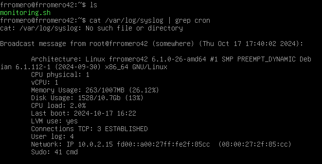

# Born2BeRoot en Debian

# Tutorial  (Solamente Parte Obligatoria)

➤ Creamos la máquina virtual y la imagen de Debian en mi directorio **sgoinfre** es un servidor accesible desde la red de la Escuela 42 y disponible desde cada computadora. Es un servidor de documentos donde tienes un directorio con tu nombre de usuario al que solo tú puedes acceder. Alcontrario que **goinfre**. Esta carpeta te permite almacenar algunos documentos. Es diferente en cada computadora y es más grande que el almacenamiento de tu sesión.

➤ Si colocas tu máquina virtual en el servidor **sgoinfre**, puedes cambiar de computadora durante tu proyecto. Si la colocas en la carpeta **goinfre**, tienes que quedarte en la misma computadora todo el tiempo.

## 1- Descargando ISO de Debian e instalando Virtual Box

➤ Crearemos una máquina virtual vacía. Para configurarla posteriormenete.

➤ Lins de descarga:

:point_right: [Click](https://www.debian.org/distrib/index.es.html) URL  ISO Debian

:point_right: [Click](https://www.virtualbox.org/) URL  Virtual Box

## 2- Instalación VM de Debian

1. Abrirmos VirtualBox y clikeamos en **Nueva**


2. Pondremos nombre de nuestra máquina y ubicación, debe de ir la carpeta **sgoinfre**, para no quedaremos sin espacio.


3. Seleccionamos la cantidad de memoria RAM que reservaremos para la máquina.


4. **Disco duro**, seleccionamos la segunda opción para así crear un disco duro **virtual ahora**.


5. Tipo de **archivo**, escogemos la primera opción **VDI**, ya que nos hemos descargado una imagen de disco.


6. Seleccionamos  **Reservado dinámicamente** ya que nos irá reservando memoria en la máquina real según la utilicemos hasta límite máximo disponible en la VM.


7. Después de elegir la cantidad de memoria recomendada **12 GB** o **30 Gb** si hacemos bonus, y le damos a **crear**.


8. Ahora nos vamos a **Configuración** / **Almacenamiento** / **Controlador IDE** / **Vacío** y nos vamos a **unidad óptica** / y sobre **IDE secundario maestro** clickeamos en el icono del **disco** y elegimos **Seleccionar un archivo de disco**...


9. Seleccionaremos la ISO que tenemos y le damos a **Abrir** / **Aceptar**.

10.  Ya podemos **Iniciar** nuestra máquina virtual.


## 3- Instalación Debian en nuestra VM

➤ En esta parte, configurarás los primeros elementos de tu máquina. Harás lo siguiente:

 - Seleccionar el idioma, la zona horaria y el país en el que funcionará tu máquina.
 - Crear un nombre de host (tu_login_42) y una contraseña para tu máquina.
 - Crear un primer usuario simple (tu_login_42) y una contraseña para dicho usuario.
 - Configurar las particiones de tu máquina.

### ¿Qué es el particionamiento de disco con LVM?

El **particionamiento de disco** creación de una o más regiones de almacenamiento, cada región pueda gestionarse por separado.

Cada O.S. gestiona diferente las particiones. En Linux, se designan: `sdXN`, donde `X` es una letra que representa el medio y `N` es el número de la partición en el medio (ej:, `sdb3` para la tercera partición del disco b).

El particionamiento ofrece ventajas en términos de seguridad.

Reservar particiones para servicios que pueden generar un gran volumen de datos y evitar saturar las particiones del sistema.

Breve lista de particiones que pueden existir (y que usamos en este proyecto):

- `/`
  Contiene el resto del árbol del sistema.

- `/boot`
  Contiene datos que se utilizan antes de que el kernel comience a ejecutar programas en modo usuario.

- `/var`
  Contiene archivos variables.

- `/tmp`
  Contiene archivos temporales.

- `/home`
  Contiene los directorios de los usuarios.

### ¿Y qué es LVM?     (Logical Volume Manager)

"Particiones dinámicas", puedes crear, redimensionar o eliminar particiones LVM (llamadas "volúmenes lógicos" en el lenguaje de LVM) desde la línea de comandos mientras tu sistema Linux está en funcionamiento.Si reiniciar el sistema para que el kernel reconozca las particiones recién creadas o redimensionadas.

1. Versión **SIN** interfaz gráfica **Install**, (indicado por el subject)


2. Seleción de idioma que usaremos para instalar y el predeterminado de nuestro sistema **English**.


3. Introducimos el País, territorio o zona. para colocar España nos vamos a **Other** / **Europe** / **Spain**.


4. Combinación lenguaje / país **Configure locales** seleccionamos **United States**.


5. Debemos seleccionar **American English** en configuración de teclado, si no habrá problemas de teclas mal enlazadas.


6. Nombre de **Host Name** de la máquina, será tu login seguido de 42.


7. **Domain name** apartado que dejaremos vacío, en el subject no menciona rellenarlo, y le damos a continuar .


1. Nuestra contraseña de la cuenta de administración del sistema. **Apúntala**, la usaremos. Asegurate que la has escrito correctamente, tabula hasta la opción **Show Password in Clear** dale a la barra espaciadora y podrás ver tu clave.


9. Repetimos el proceso de nuevo.

10. Nombre de nuestro nuevo usuario. tenemos que crear un usuario adicional como menciona el subject y no debe de ser el root con nuestro login, así que llamaremos **frromero** al nuevo usuario, y nos lo vuelve a pedir de nuevo.


11. Introduciremos la contraseña de nuestro nuevo usuario. repitiendolo dos veces el proceso, es importante que la guardes porque la utilizaremos.


12. Colocamos la hora de nuestra localización.


13. Selecionamos la tercera opción **Guied - use entire disk and set up encrypted LVM**, el subject nos comenta que deben ser particiones cifradas, **Manual** para el bonus (pero no te sirve este tutorial)


14. Disco en el que queremos hacer el particionado (Debe de haber solo un disco).


15. **Particiones**, seleccionar la segunda opción **Separate /home partition**.


16. Validamos **Yes** para guardar los cambios en el disco y configurar el gestor de volúmenes lógicos (LVM).


17. No es necesario borrar los datos, daremos a **Cancel** ya que lo estamos haciendo en un entrono virtual .


18. Otra contraseña, ahora será la frase de encriptación. Repites proceso, y anótala la usaremos después.


19. Colocar la cantidad de volumen que usaremos en la partición guiada. ponemos **max** o el número máximo disponible.


20. Finalizamos y escribimos los cambios, selecionamos **Finish partitioning and write changes to disk**.


21. **Yes** para continuar y confirmar los cambios en el disco.


22. **No** necesitamos paquetes adicionales.


23. **Package Manager** elegimos nuestro país.


24. **Configure package manager**, elegimos la opción recomendada **deb.debian.org**


25. El proxy lo dejamos vacío y le daremos **Continue**.


26. **No** para que los developers vean nuestras estadísticas aunque sean anónimas.


27.  Eliminamos todas las opciones de software (con barra espaciadora) y **Continue**.


28. **Yes** para instalar **GRUB boot**.
➤ GNU GRUB (GNU GRand Unified Bootloader) es un cargador de arranque múltiple, desarrollado por el proyecto GNU que nos permite **elegir qué Sistema Operativo** arrancar de los instalados.


29. Selecionamos el dispositivo instalar del cargador de arranque **/dev/sda (ata_VBOX_HARDDISK)**.


30. **Continue** finalizar la instalación.


# 4 Configurando la máquina virtual (VM)

## aptitude
➤ Recuerda qué paquetes se solicitaron explícitamente y cuáles se instalaron solo debido a dependencias.
     y  desinstalará automáticamente los paquetes que no se solicitaron explícitamente cuando ya no sean necesarios.
## apt
➤ Solo hará exactamente lo que se le indique en la línea de comandos.

## APPArmor

➤ Es un sistema de seguridad en Linux que proporciona control de acceso obligatorio (MAC). Permite al administrador del sistema restringir las acciones que los procesos pueden realizar. Está incluido por defecto en Debian.

➤ Ejecuta aa-status para comprobar si está funcionando.

## SSH (Secure Shell)

➤ SSH significa "Secure Shell", permitirá administrar tus servidores Linux, tanto localmente, (físicamente frente a tu servidor), o remota a tus servidores para administrarlos.

## UFW (Uncomplicated Firewall)

➤ Protección de red definiendo comunicaciones permitidas o prohibidas mediante reglas. Supervisa el tráfico de red entrante y saliente y decide si bloquear o permitir dicho tráfico.

➤ Nosotrtos en este proyecto dejaremos abierto solo el puerto 4242.

## Política de Contraseñas

➤ Es un conjunto de reglas diseñadas para mejorar la seguridad alentando a los usuarios a usar contraseñas relativamente seguras y a usarlas correctamente.
(que expire cada 30 días, tenga más de 10 caracteres y no contenga secuencias lógicas, y que contenga letras mayúsculas, caracteres especiales y números).

➤ Cada usuario de tu máquina virtual deberá seguir las siguientes reglas de contraseñas:
```
    PASS_MAX_DAYS 30
    PASS_MIN_DAYS 2
    PASS_WARN_AGE 7
```

Es posible que tu usuario predeterminado no tenga estas modificaciones, por lo que deberás hacerlo manualmente.

Para ver qué parámetros de contraseña están asociados a un usuario, puedes escribir este comando:

➤ bash

➤ sudo chage -l nombre_usuario

➤ Si los valores no corresponden a los indicados, deben cambiarse manualmente de la siguiente manera:

``` bash

sudo chage -M 30 <usuario>
sudo chage -m 2 <usuario>
sudo chage -W 7 <usuario>
```
## Grupos y usuarios

➤ Linux utiliza grupos como una forma de organizar a los usuarios. Existen para simplificar la gestión de permisos de archivos y carpetas. Linux está diseñado para permitir que varios usuarios accedan al sistema al mismo tiempo, pero con permisos diferentes.


➤ **root** es el superusuario y tiene la capacidad de hacer cualquier cosa en el sistema. Para tener una capa adicional de seguridad, generalmente se usa un usuario **sudo** en lugar de **root**.

➤ Necesitarás instalar sudo. Sudo significa "superuser do". En pocas palabras, sudo le otorga al usuario designado un "superpoder" para actuar como administrador temporalmente. sudo se utiliza para dar a otro usuario acceso limitado a la cuenta de otro con el fin de realizar tareas administrativas. Permite que un usuario tenga privilegios de administrador sin iniciar sesión directamente como root.

➤Esta gestión de derechos asignados a los usuarios está contenida en el archivo **/etc/sudoers**

## Crontab

➤ **Cron** es un programa que permite a los usuarios de sistemas Unix ejecutar automáticamente scripts, comandos o software en una fecha y hora predefinidas o en un ciclo predefinido.

➤  En este proyecto tendrás que publicar un mensaje cada 10 minutos.

➤ Creas un script (en nuestro caso será el script de monitoreo que contiene toda la información) que quieras ejecutar usando cron.
Luego, escribes **sudo crontab -u root -e** para abrir crontab y agregar una regla.

La regla:

``` bash

* * * * * <ruta>/<nombre_del_programa_a_ejecutar>

Donde * * * * * significa cada minuto de cada hora de cada día de cada mes y cada día de la semana. Algunos ejemplos:

    0 * * * *: esto significa que cron se ejecutará siempre cuando los minutos sean 0 (entonces, cada hora).
    0 1 * * *: esto significa que cron se ejecutará siempre a la 1 en punto.
    * 1 * * *: esto significa que cron se ejecutará cada minuto cuando la hora sea la 1, es decir, 1:00, 1:01... hasta las 1:59.
    */10 * * * *: significa que cron se ejecutará cada 10 minutos.
```
## Signature.txt

➤ Una firma es un número identificador único para un disco duro u otro dispositivo de almacenamiento de datos. Un sistema operativo la utiliza para diferenciar entre los dispositivos de almacenamiento en tu computadora.

# INICIANDO EL SISTEMA

➤ Seleccionamos **Debian GNU/Linux**.

➤ Nos pide la contraseña de encriptación.


➤ Debemos introducir el usuario y contraseña que hemos creado. Usuario **frromero** y la contraseña **42Madrid13/12**


### Ya tenemos todo listo para empezar a configurar nuestra máquina virtual Debian

### 4.1 - Instalación de sudo y configuración de usuarios y grupos

- Si por algún motivo detectas algún error con tu etc/hosts
  Puedes verificar y corrigir el archivo /etc/hosts

- Asegúrate de que el archivo /etc/hosts contenga la entrada correcta para el nombre del host. Haz lo siguiente:

- Abre el archivo /etc/hosts para editarlo
Asegúrate de que haya una línea que se vea así:

```bash

nano /etc/hosts

127.0.0.1   localhost
127.0.1.1   frromero42

```

1. Instalando **sudo**, nos pasamos usuario root, ponemos **Su** en el terminal e introduciremos la contraseña, **42Madrid13/12**. Y ahora ponemos el comando **apt install sudo** para instalar los paquetes necesarios.


2. Reiniciamos la máquina para aplicar cambios **sudo reboot**.


3. Ahora de nuevo introducimos contraseñas de cifrado y usuario. Verifcamos la instalación en tramos de nuevo como usuario root y ponemos **sudo -V**, además de mostrarnos la versión de sudo, mostrará los argumentos pasados para configurar cuando se creó sudo y los plugins que pueden mostrar información más detallada. **sudo -V | more** para ver todo el contenido.

4. Estando en super usuario: (**su**)  crearemos un usuario con nuestro login **sudo adduser login** como ya lo habiamos hemos creado la instalación nos debe aparecer que el usuario ya existe.

5. Ahora crearemos un nuevo grupo llamado **user42**. con **sudo addgroup user42**.

 - <b>GID</b> identificador de grupo, abreviatura de Group ID.

6. Verificado de la creación correcta de grupos: **getent group nombre_grupo** o en **cat /etc/group** y veremos todos los grupos y los usuarios que hay dentro de ellos.

7. Con el comando **sudo adduser user group** incluiremos al usuario en el grupo.
   Debemos incluir al usuario en los grupos **sudo** y **user42**.

8. Después de incluirlos dentro de los grupos podemos ejecutar el comando **getent group nombre_grupo** o editar **nano /etc/group** y en los grupos **sudo** y **user42** deberá aparecer nuestro usuario.


### 4.2 - SSH Instalación y configuración

- <b>Qué es SSH?</b> Nombre de un protocolo y programa que se encarga de dar acceso remoto a un servidor por un canal seguro donde la información va cifrada.

1. Actualizamos repositorios  **sudo apt update** definidos en el archivo /etc/apt/sources.list

2. Instalando la herramienta para este protocolo SSH, **OpenSSH**. Con el comando **sudo apt install openssh-server**.


Para comprobar que se haya instalado correctamente haremos **sudo service ssh status** y nos debe aparecer active.


3. Despuésde la instalación hay ficheros que configurar. Utilizaremos [Nano](https://es.wikipedia.org/wiki/GNU_Nano),
   - Primer fichero que editaremos será **nano /etc/ssh/sshd_config**. nos vamos a **su** para tener permisos de escritura, o **sudo nano /etc/ssh/sshd_config**


4. Los comentarios de linea empiezan por **#**, las líneas a modificar hay que quitarle el comentario.
   - Líneas a modificar:

➤ #Port 22 -> Port 4242

➤ #PermitRootLogin prohibit-password -> PermitRootLogin no


- Guardamos cambios.

5. Ahora editamos el fichero **/etc/ssh/ssh_config**.

- Editaremos la siguiente línea:

➤ #Port **22** a Port **4242**


6. Reiniciamos el servicio ssh para actualizar los cambios **sudo service ssh restart** y revisaremos los cambios con  **sudo service ssh status** y veremos la escucha del servidor debe aparecer el Puerto **4242**.


### 4-3 Instalación y configuración de UFW

- [UFW](https://es.wikipedia.org/wiki/Uncomplicated_Firewall) Es un [firewall](https://es.wikipedia.org/wiki/Cortafuegos_(inform%C3%A1tica)) el cual utiliza la línea de comandos para configurar las [iptables](https://es.wikipedia.org/wiki/Iptables) usando un pequeño número de comandos simples.

1. Instalando **UFW**, con el  comando **sudo apt install ufw**

2. Lo habilitamos con el comando **sudo ufw enable** y veremos que el firewall está activo.


3. Nuestro firewall tinen que permitir las conexiones por el puerto 4242. Lo haremos con el comando **sudo ufw allow 4242**.


4.  Y lo comprobaremos con el comando **sudo ufw status**.


### 4-4 Configurando contraseña fuerte para sudo

1. Crearemos un fichero en la ruta **/etc/sudoers.d/** le pondremos de nombre sudo_config, almacenará la configuración de la contraseña. lo crearemos con **touch /etc/sudoers.d/sudo_config**.


2. Hay que crear el directorio sudo en la ruta /var/log yºa que cada comando que ejecutemos con sudo, tanto el input como el output, debe quedar almacenado en ese directorio. **mkdir /var/log/sudo**.


3. Editaremos el fichero de configuracion de sudo con  **nano /etc/sudoers.d/sudo_config**.

4. Una vez estamos editando el fichero deberemos introducir los siguientes comandos para cumplir todos los requisitos que pide el subject.


## DESGLOSANDO LOS COMANDOS

Defaults  **passwd_tries=3** (nº de reintentos)

Defaults  **badpass_message="Password entry failure!"**

Defaults  **logfile="/var/log/sudo/sudo_config"** (archivos de registro de comandos sudo lanzados)

Defaults  **log_input, log_output** (comandos tanto imput como output quedarán registrados en el siguiente directorio)

Defaults  **iolog_dir="/var/log/sudo"**

Defaults  **requiretty**  (activar modo TTY)

Defaults  **secure_path="/usr/local/sbin:/usr/local/bin:/usr/sbin:/usr/bin:/sbin:/bin:/snap/bin**  (restringir los directorios utilizables por sudo)


### 4-5 Configuración de política de contraseñas fuerte

1. Editaremos el fichero login.defs: **nano /etc/login.defs**


2. Una vez estemos editando el fichero, modificaremos los siguientes parámetros:

➤ PASS_MAX_DAYS 99999 -> PASS_MAX_DAYS 30

➤ PASS_MIN_DAYS 0 -> PASS_MIN_DAYS 2


PASS_MAX_DAYS: Es el tiempo de expiración de la contraseña. El número corresponde a días.

PASS_MIN_DAYS: El número mínimo de días permitido antes de modificar una contraseña.

PASS_WARN_AGE: El usuario recibirá un mensaje de aviso indicando que faltan los días especificados para que expire su contraseña.

3. Para poder seguir con la configuración debemos instalar los siguientes paquetes con este comando **sudo apt install libpam-pwquality** , acto seguido pondremos **Y** para confirmar la instalación y esperaremos a que termine.


4. Lo siguiente que debemos hacer es volver a editar un fichero y modificar algunas líneas. Haremos **nano /etc/pam.d/common-password**.


5. Después de retry=3 debemos añadir los siguientes comandos:

```
minlen=10
ucredit=-1
dcredit=-1
lcredit=-1
maxrepeat=3
reject_username
difok=7
enforce_for_root
```


 <b>Que hace cada comando?</b>

**minlen=10** ➤ La cantidad mínima de caracteres que debe contener la contraseña.

**ucredit=-1** ➤ Como mínimo debe contener una letra mayúscula. Ponemos el - ya que debe contener como mínimo un carácter, si ponemos + nos referimos a como máximo esos caracteres.

**dcredit=-1** ➤ Como mínimo debe contener un dígito.

**lcredit=-1** ➤ Como mínimo debe contener una letra minúscula.

**maxrepeat=3** ➤ No puede tener más de 3 veces seguidas el mismo carácter.

**reject_username** ➤ No puede contener el nombre del usuario.

**difok=7** ➤  Debe tener al menos 7 caracteres que no sean parte de la antigua contraseña.

**enforce_for_root** ➤ Implementaremos esta política para el usuario root.

6. **La política de contraseñas** Afecta solo a los usuarios nuevos. Es necesario actualizar las cuentas de los usuarios que fueron creadas antes de esta política para que cumplan con los nuevos requisitos de seguridad. Haremos uso del comando **sudo chage -l username**.


7. **sudo chage -m 2 -M 30 frromero** Cambia el mínimo a 2 dias y el maximo a 30 días.

**-m** es para el número mínimo de días y **-M** para el numero máximo.


### 4-6 Conectarse vía SSH

1. Para conectarnos por SSH debemos cerrar la máquina, abrir VirtualBox y darle a configuración.


2. Una vez en configuración debemos pinchar sobre el apartado de **Red**, pincharemos sobre **Avanzadas** para que así nos muestre más opciones y le daremos a **Reenvío de puertos**.


3. Pincharemos sobre el siguiente emoticono para agregar una regla de reenvío.


4. Por último, agregaremos el puerto **4242** al anfitrión y al invitado. Las IP's no son necesarias. Pincharemos sobre el botón de aceptar para que así se apliquen los cambios.


➤ Para poder conectarnos a la máquina virtual desde la real debemos abrir un terminal en la máquina real y escribir **ssh frromero@localhost -p 4242** nos pedirá la clave del usuario y una vez la introduzcamos ya nos saldrá el login en verde y eso significa que estaremos conectados.


## 5- Script

Esta es una parte muy importante del proyecto. Debes prestar atención en todo, muy importante no copiar y pegar directamente el fichero sin saber que hace cada cosa. En la evaluación debes explicar cada comando si el evaluador lo pide.

<b>Qué es un script?</b> Es una secuencia de comandos guardada en un fichero que cuando se ejecuta hará la función de cada comando.

### 5-1 Architecture

El comando `uname -a` muestra información completa sobre el sistema, y el argumento **`-a`** es equivalente a **`--all`**. Ambos muestran todos los detalles disponibles del sistema en una sola línea.

### Explicación de **`uname -a`**:
El comando **`uname`** se usa para mostrar información sobre el sistema operativo y el hardware. La opción **`-a`** o **`--all`** incluye toda la información disponible.

- **`-a`** o **`--all`**: Muestra toda la información disponible, que incluye:
  - **Kernel name**: Nombre del núcleo (normalmente "Linux").
  - **Node name**: Nombre del host (nombre de la máquina).
  - **Kernel release**: Versión del núcleo del sistema operativo.
  - **Kernel version**: Fecha y detalles de la compilación del núcleo.
  - **Machine hardware name**: Tipo de hardware (como `x86_64`).
  - **Processor type**: Tipo de procesador.
  - **Hardware platform**: Plataforma de hardware.
  - **Operating system**: Nombre del sistema operativo.

```bash
Linux frromero42 6.1.0-26-amd64 #1 SMP PREEMPT_DYNAMIC Debian 6.1.112-1 (2024-09-30) x86_64 GNU/Linux
```

### Detalle de la salida:
- **`Linux`**: Nombre del kernel.
- **`frromero42`**: Nombre del host.
- **`6.1.0-26-amd64`**: Versión del kernel.
- **`#1 SMP PREEMPT_DYNAMIC Debian 6.1.112-1 (2024-09-30)`**: Información adicional sobre el kernel (versión, compilación).
- **`x86_64`**: Tipo de máquina (64 bits).
- **`GNU/Linux`**: Sistema operativo.

### 5-2 Núcleos físicos


```bash
cpuf=$(grep "physical id" /proc/cpuinfo | wc -l)
```

1. **`/proc/cpuinfo`**:
   - El archivo **`/proc/cpuinfo`** contiene información detallada sobre los procesadores del sistema.
   - En particular, para cada núcleo físico de la CPU, aparece un campo llamado **"physical id"**, que identifica la CPU física a la que pertenece el núcleo.

2. **`grep "physical id"`**:
   - **`grep "physical id"`** busca todas las líneas en `/proc/cpuinfo` que contienen el texto **"physical id"**.
   - Este campo aparece una vez por cada núcleo físico (o una vez por cada hilo, dependiendo del soporte de Hyper-Threading del sistema).

3. **`wc -l`**:
   - **`wc -l`** cuenta el número de líneas que contienen "physical id", lo que en este caso indica cuántos **núcleos físicos** o **CPUs físicas** están presentes en el sistema.

### Resultado:
- Si el sistema tiene múltiples núcleos físicos, o varios procesadores físicos, el comando devolverá un número que representa la cantidad de líneas con "physical id" (número de CPUs físicas o núcleos físicos).
- El resultado se almacena en la variable `cpuf`.


### 5-3 Núcleos virtuales

Este comando calcula el **número de CPUs virtuales (vCPU)** o **núcleos de procesamiento** en el sistema y almacena el resultado en la variable `cpuv`.


```bash
cpuv=$(grep "processor" /proc/cpuinfo | wc -l)
```

1. **`/proc/cpuinfo`**:
   - El archivo **`/proc/cpuinfo`** contiene información detallada sobre los procesadores del sistema, incluyendo datos como la arquitectura, modelo, velocidad y el número de CPUs disponibles (físicos y virtuales).
   - Cada CPU (o núcleo de CPU) tiene una entrada en este archivo.

2. **`grep "processor"`**:
   - **`grep "processor"`** busca en el archivo `/proc/cpuinfo` todas las líneas que contengan la palabra **"processor"**.
   - Las líneas que contienen `"processor"` representan cada **núcleo virtual (vCPU)** en el sistema. Por ejemplo, si tienes 4 núcleos virtuales (o 4 hilos en un sistema con Hyper-Threading), verás 4 líneas con `"processor"`.

3. **`wc -l`**:
   - **`wc -l`** cuenta el **número de líneas** que contienen la palabra `"processor"`, lo cual corresponde al **número total de CPUs virtuales (vCPU)** o núcleos en el sistema.

4. **`cpuv=$(...)`**:
   - El número resultante de la operación (la cantidad de CPUs virtuales) se almacena en la variable `cpuv`.


### 5-4 Memoria RAM

Este fragmento de código calcula el **uso total, el usado y el porcentaje de disco**.

 1. **`disk_total=$(df -m | grep "/dev/" | grep -v "/boot" | awk '{disk_t += $2} END {printf ("%.1fGb\n"), disk_t/1024}')`**
   - **`df -m`**: Muestra el uso de disco en megabytes (MB).
   - **`grep "/dev/"`**: Filtra las líneas que contienen el texto "/dev/", que representan particiones montadas en el sistema.
   - **`grep -v "/boot"`**: Excluye las líneas que contienen "/boot", ya que no queremos incluir la partición de arranque en el cálculo.
   - **`awk '{disk_t += $2} END {printf ("%.1fGb\n"), disk_t/1024}'`**:
     - `disk_t += $2`: Suma los valores de la segunda columna (`$2`), que representa el **tamaño total** del disco en megabytes.
     - **`END {printf ("%.1fGb\n"), disk_t/1024}`**: Después de procesar todas las líneas, convierte el tamaño total de MB a GB dividiendo por 1024 y lo formatea con un decimal.

   **Resultado**: El total de espacio en disco (en GB) se guarda en `disk_total`.

 2. **`disk_use=$(df -m | grep "/dev/" | grep -v "/boot" | awk '{disk_u += $3} END {print disk_u}')`**
   - **`df -m`**: Nuevamente muestra el uso de disco en MB.
   - **`grep "/dev/"`** y **`grep -v "/boot"`**: Filtran las particiones del sistema igual que en el primer comando.
   - **`awk '{disk_u += $3} END {print disk_u}'`**:
     - `disk_u += $3`: Suma los valores de la tercera columna (`$3`), que representa el **espacio usado** en megabytes.
     - **`END {print disk_u}`**: Al final, imprime el total de MB usados.

   **Resultado**: El total de espacio usado en disco (en MB) se guarda en `disk_use`.

 3. **`disk_percent=$(df -m | grep "/dev/" | grep -v "/boot" | awk '{disk_u += $3} {disk_t += $2} END {printf("%d", disk_u/disk_t*100)}')`**
   - **`df -m`**: Muestra el uso del disco en MB.
   - **`grep "/dev/"`** y **`grep -v "/boot"`**: Filtran las particiones del sistema como en los comandos anteriores.
   - **`awk '{disk_u += $3} {disk_t += $2} END {printf("%d", disk_u/disk_t*100)}'`**:
     - `disk_u += $3`: Suma el espacio usado de todas las particiones.
     - `disk_t += $2`: Suma el tamaño total de todas las particiones.
     - **`END {printf("%d", disk_u/disk_t*100)}`**: Al final, calcula el **porcentaje de uso de disco** dividiendo el espacio usado por el total y multiplicando por 100. El resultado es formateado como un número entero.

   **Resultado**: El porcentaje de uso de disco se guarda en `disk_percent`.

---

### Resumen:
1. **`disk_total`**: Calcula el tamaño total de las particiones del disco (en GB).
2. **`disk_use`**: Calcula el espacio en disco actualmente usado (en MB).
3. **`disk_percent`**: Calcula el porcentaje del disco que está ocupado.

Todo esto excluye la partición de arranque (`/boot`) para obtener solo el uso de las particiones relevantes.

### 5-6 Porcentaje uso de CPU


1. **`vmstat 1 2`**: Ejecuta el comando `vmstat` para recoger estadísticas del sistema cada 1 segundo, dos veces. La primera línea suele ser información acumulada, mientras que la segunda refleja el estado actual.
2. **`tail -1`**: Selecciona la última línea de la salida, que contiene las estadísticas más recientes.
3. **`awk '{printf $15}'`**: Extrae el valor de la 15ª columna, que corresponde al **porcentaje de tiempo que el CPU está inactivo** (`id`).
4. **`expr 100 - $cpul`**: Calcula el **porcentaje de uso del CPU** restando el porcentaje de inactividad de 100.
5. **`printf "%.1f" $cpu_op`**: Formatea el porcentaje de uso del CPU con un decimal, por ejemplo, `15.0%` de uso.

En resumen, el código obtiene el porcentaje de tiempo que el CPU está inactivo y luego calcula el porcentaje que está siendo utilizado.

### 5-7 Último reinicio

Este comando extrae la **fecha y hora del último arranque del sistema**.

 **`lb=$(who -b | awk '$1 == "system" {print $3 " " $4}')`**

1. **`who -b`**:
   - El comando **`who`** muestra información sobre los usuarios conectados y eventos del sistema.
   - La opción **`-b`** (short for "boot") muestra la **fecha y hora del último arranque del sistema**. La salida tiene un formato similar a este:
     ```
     system boot 2024-10-17 16:22
     ```

2. **`awk '$1 == "system" {print $3 " " $4}'`**:
   - **`awk`** es una herramienta para procesar texto.
   - **`$1 == "system"`**: Filtra las líneas donde la primera columna (`$1`) es igual a `"system"`, ya que indica un evento de arranque del sistema.
   - **`{print $3 " " $4}`**: Extrae y imprime la tercera y cuarta columnas de la salida:
     - **`$3`**: Es la **fecha del último arranque** (por ejemplo, `2024-10-17`).
     - **`$4`**: Es la **hora del último arranque** (por ejemplo, `16:22`).

   En resumen, se imprime la **fecha y hora del último arranque del sistema**.

3. **`lb=$(...)`**:
   - El resultado de este comando (`$3 " " $4`) se guarda en la variable **`lb`**, que contiene la fecha y hora del último arranque.


### 5-8 Uso LVM

Este fragmento de código verifica si el sistema está usando **LVM (Logical Volume Manager)** y guarda el resultado en la variable `lvmu`.


```bash
lvmu=$(if [ $(lsblk | grep "lvm" | wc -l) -gt 0 ]; then echo yes; else echo no; fi)
```

1. **`lsblk`**:
   - **`lsblk`** es el comando que lista información sobre los dispositivos de bloque (discos y particiones) del sistema.
   - Su salida incluye información sobre el tipo de dispositivos, y si el sistema usa LVM, algunas líneas contendrán el texto **"lvm"** en la columna correspondiente al tipo de dispositivo.

2. **`grep "lvm"`**:
   - **`grep "lvm"`** busca dentro de la salida de `lsblk` cualquier línea que contenga el texto **"lvm"**, lo cual indica que el sistema está utilizando LVM en al menos una de sus particiones o volúmenes.

3. **`wc -l`**:
   - **`wc -l`** cuenta el número de líneas que contienen la palabra "lvm". Si hay **una o más líneas**, significa que LVM está en uso. Si no hay ninguna línea, entonces no se está utilizando LVM.

4. **`if [ $(...) -gt 0 ]`**:
   - Este condicional evalúa si el número de líneas encontradas por `grep "lvm"` es **mayor que 0** (`-gt 0`). Si es mayor que 0, significa que se ha detectado el uso de LVM.

5. **`then echo yes; else echo no; fi`**:
   - Si el número de líneas es mayor que 0, el comando ejecuta `echo yes`, indicando que LVM está en uso.
   - Si el número de líneas es 0, el comando ejecuta `echo no`, indicando que LVM **no** está en uso.

6. **`lvmu=$(...)`**:
   - El resultado del bloque condicional (`yes` o `no`) se almacena en la variable `lvmu`.

### Resultado:
- Si **LVM está en uso**, la variable `lvmu` tendrá el valor `yes`.
- Si **LVM no está en uso**, la variable `lvmu` tendrá el valor `no`.

`

### 5-9 Conexiones TCP

Este comando cuenta el número de **conexiones TCP establecidas** en el sistema y almacena el resultado.

```bash
ss -ta | grep ESTAB | wc -l
```

1. **`ss -ta`**:
   - **`ss`** (socket statistics) es una herramienta que muestra estadísticas de sockets, es decir, información sobre conexiones de red activas.
   - La opción **`-t`** filtra las conexiones **TCP**.
   - La opción **`-a`** muestra **todas** las conexiones TCP, tanto activas como en espera, con diferentes estados como LISTEN, ESTABLISHED, TIME-WAIT, etc.

2. **`grep ESTAB`**:
   - **`grep ESTAB`** filtra las conexiones TCP que están en el estado **ESTABLISHED** (establecidas).
   - El estado **ESTABLISHED** significa que la conexión TCP está activa y completamente configurada para intercambiar datos entre dos hosts.

3. **`wc -l`**:
   - **`wc -l`** cuenta el número de líneas que devuelve el comando anterior.
   - En este caso, cada línea representa una conexión TCP en estado **ESTABLISHED**, por lo que `wc -l` cuenta el número total de conexiones activas.

### 5-10 Número de usuarios

**usuarios actualmente conectados al sistema**

```bash
users | wc -w
```

1. **`users`**:
   - Este comando muestra una lista de los nombres de los usuarios que están actualmente conectados al sistema.
   - La salida es una lista de los nombres de usuario separados por espacios, cada uno representando a un usuario que tiene una sesión activa.

   **Ejemplo de salida:**
   ```
   user1 user2 user3
   ```

2. **`wc -w`**:
   - **`wc`**  **word count**. La opción **`-w`** cuenta el número de palabras en la entrada que recibe.
   - Ees decir cuántos nombres de usuario hay en la salida del comando `users`.


### 5-11 Dirección IP y MAC

Para obtener la dirección del host haremos uso del comando **hostname -I** y para obtener la MAC haremos uso del comando **ip link** que se utiliza para mostrar o modificar las interfaces de red. Como aparecen más de una interfaz, IP's etc. Utilizaremos el comando grep para buscar lo que deseamos y así poder printar por pantalla solo lo que nos piden. Para ello pondremos **ip link | grep "link/ether" | awk '{print $2}'** y de esta manera solo printaremos la MAC.


### 5-12 Número de comandos ejecutados con sudo

Para poder obtener el número de comandos que son ejecutados con sudo haremos uso del comando journalctl que este es una herramienta que se encarga de recopilar y administrar los registros del sistema. Acto seguido pondremos **_COMM=sudo** par así filtrar las entradas especificando su ruta. En nuestro ponemos **_COMM** , ya que hace referencia a un script ejecutable. Una vez tengamos filtrada la búsqueda y solo aparezcan los registros de sudo todavía deberemos filtrar un poco más, ya que cuando inicias o cierras sesión de root también aparece en el registro, entonces para terminar de filtrar pondremos un **grep COMMAND** y asi solo aparecerán las líneas de comandos. Por último pondremos **wc -l** para que asi nos salgan enumeradas las líneas. El comando entero es el siguiente: **journalctl _COMM=sudo | grep COMMAND | wc -l)**. Para comprobar que funcione correctamente podemos correr el comando en el terminal, poner un comando que incluya sudo y volver a correr el comando y deberá
incrementar el número de ejecuciones de sudo.


### 5-13 Script

```
#!/bin/bash

# O.S. ARCHITECTURE
architecture=$(uname -a)

# PHYSICAL CPU identifier
cpu_phy=$(grep "physical id" /proc/cpuinfo | wc -l)

# Number of virtual processors (vCPUs)
vcpus=$(grep "processor" /proc/cpuinfo | wc -l)

# MEMORY RAM
total_memory=$(free --mega | awk '$1 == "Mem:" {print $2}')
used_memory=$(free --mega | awk '$1 == "Mem:" {print $3}')
memory_usage_percent=$(free --mega | awk '$1 == "Mem:" {printf("%.2f"), $3/$2*100}')

# DISK
total_disk_space=$(df -m | grep "/dev/" | grep -v "/boot" | awk '{disk_t += $2} END {printf ("%.1fGb\n"), disk_t/1024}')
used_disk_space=$(df -m | grep "/dev/" | grep -v "/boot" | awk '{disk_u += $3} END {print disk_u}')
disk_usage_percent=$(df -m | grep "/dev/" | grep -v "/boot" | awk '{disk_u += $3} {disk_t += $2} END {printf("%d"), disk_u/disk_t*100}')

# CPU load
inactive_cpu=$(vmstat 1 2 | tail -1 | awk '{printf $15}')
cpu_usage=$(expr 100 - $inactive_cpu)
formatted_cpu=$(printf "%.1f" $cpu_usage)

# LAST BOOT
last_boot=$(who -b | awk '$1 == "system" {print $3 " " $4}')

# LVM USE
lvm_use=$(if [ $(lsblk | grep "lvm" | wc -l) -gt 0 ]; then echo yes; else echo no; fi)

# TCP CONNECTIONS
tcp_connections=$(ss -ta | grep ESTAB | wc -l)

# USER LOG
user_log=$(users | wc -w)

# NETWORK
ip_net=$(hostname -I)
mac=$(ip link | grep "link/ether" | awk '{print $2}')

# SUDO COMMANDS
sudo_commands=$(journalctl _COMM=sudo | grep COMMAND | wc -l)

# Wall message
wall "	# Architecture: $architecture
	# CPU physical: $cpu_phy
	# vCPU: $vcpus
	# Memory Usage: $used_memory/${total_memory}MB ($memory_usage_percent%)
	# Disk Usage: $used_disk_space/${total_disk_space} ($disk_usage_percent%)
	# CPU load: $formatted_cpu%
	# Last boot: $last_boot
	# LVM use: $lvm_use
	# TCP Connections: $tcp_connections ESTABLISHED
	# User log: $user_log
	# Network: IP $ip_net ($mac)
	# Sudo: $sudo_commands cmd"
```

Ejecución del script:




## 6- Crontab

<b>Qué es crontab? </b>Es un administrador de procesos en segundo plano. Los procesos indicados serán ejecutados en el momento que especifiques en el fichero crontab.

Para tener correctamente crontab configurado debemos editar el fichero crontab con el siguiente comando **sudo crontab -u root -e**.

En el fichero debemos añadir el siguiente comando para que el script se ejecute cada 10 minutos _*/10 * * * * sh /ruta del script_.


Funcionamiento de cada parámetro de crontab:

m ➤ Corresponde al minuto en que se va a ejecutar el script, el valor va de 0 a 59.

h ➤ La hora exacta, se maneja el formato de 24 horas, los valores van de 0 a 23, siendo 0 las 12:00 de la medianoche.
dom ➤ hace referencia al día del mes, por ejemplo se puede especificar 15 si se quiere ejecutar cada día 15.

dow ➤ Significa el día de la semana, puede ser numérico (0 a 7, donde 0 y 7 son domingo) o las 3 primeras letras del día en inglés: mon, tue, wed, thu, fri, sat, sun.

user ➤ Define el usuario que va a ejecutar el comando, puede ser root, u otro usuario diferente siempre y cuando tenga permisos de ejecución del script.

command ➤ Refiere al comando o a la ruta absoluta del script a ejecutar.

## 7- Signature.txt 📝

Para obtener la firma lo primero que debemos hacer es apagar la máquina virtual ya que una vez la enciendas o modifiques algo la firma cambiará.


El siguiente paso será ubicarnos en la ruta donde tengamos el .vdi de nuestra máquina virtual.


Por último haremos **shasum nombremaquina.vdi** y esto nos dara la firma. El resultado de esta firma es lo que tendremos añadir a nuestro fichero signature.txt para posteriormente subir el fichero al repositorio de la intra. Muy importante no volver a abrir la máquina ya que se modificara la firma. Para las correcciones recuerda clonar la máquina ya que asi podras encenderla sin miedo a que cambie la firma.

🧠 <b> Qué es shasum?</b> Es un comando que permite identificar la integridad de un fichero mediante la suma de comprobación del hash SHA-1 de un archivo.


## 9-1 Evaluación

### ▪️ Qué es una máquina virtual?

Es un software que simula un sistema de computación y puede ejecutar programas como si fuese una computadora real. Permite crear múltiples entornos simulados o recursos dedicados desde un solo sistema de hardware físico.
➤ Existen varias ventajas de tener una máquina virtual:

	- Económica
	- Ahorro de espacio físico (almacenamiento)
	- Menor mantenimiento que una máquina física
	- Respaldo de datos simplificado
	- Mayor seguridad

### ▪️ Por qué te decantaste por Debian?

 Es más sencillo y hay multitud de información.

### ▪️ Diferencias básicas entre Rocky y Debian

### 1. **Origen y Propósito**
- **Rocky Linux**: Alternativa a CentOS, basada en RHEL, enfocada en estabilidad para servidores.
- **Debian**: Distribución antigua y respetada, centrada en la libertad del software y la estabilidad.

### 2. **Gestión de Paquetes**
- **Rocky Linux**: Usa `yum`/`dnf` con paquetes RPM.
- **Debian**: Usa `apt` con paquetes DEB.

### 3. **Ciclos de Lanzamiento**
- **Rocky Linux**: Versiones LTS, actualizaciones regulares.
- **Debian**: Ciclo flexible con versiones estables, inestables y de prueba.

### 4. **Filosofía y Comunidad**
- **Rocky Linux**: Basado en la comunidad, influenciado por RHEL, mantenido por una fundación.
- **Debian**: Completamente comunitaria, regida por el "Debian Social Contract".

### 5. **Usos Comunes**
- **Rocky Linux**: Ideal para servidores y aplicaciones críticas.
- **Debian**: Usado en servidores y escritorios, flexible y personalizable.

### 6. **Entornos de Escritorio**
- **Rocky Linux**: Más común en servidores, se puede instalar un entorno de escritorio.
- **Debian**: Ofrece múltiples entornos de escritorio en la instalación.

### 7. **Configuración y Personalización**
- **Rocky Linux**: Conservador en cambios, ideal para estabilidad.
- **Debian**: Mayor flexibilidad y opciones de personalización.

Este resumen destaca las diferencias clave entre ambas distribuciones.
### ▪️ Cuál es el propósito de las máquinas virtuales?

Su objetivo es el de proporcionar un entorno de ejecución independiente de la plataforma de hardware y del sistema operativo, que oculte los detalles de la plataforma subyacente y permita que un programa se ejecute siempre de la misma forma sobre cualquier plataforma.

### ▪️ Diferencias entre apt y aptitude

Aptitude es una versión mejorada de apt. APT es un administrador de paquetes de nivel inferior y aptitude es un administrador de paquetes de alto nivel. Otra gran diferencia es la funcionalidad que ofrecen ambas herramientas. Aptitude ofrece una mejor funcionalidad en comparación con apt-get. Ambos son capaces de proporcionar los medios necesarios para realizar la gestión de paquetes. Sin embargo, si se busca un enfoque con más características, debería ser, Aptitude.

### ▪️ Qué es APPArmor ?

Es un módulo de seguridad del kernel Linux que permite al administrador del sistema restringir las capacidades de un programa.

### ▪️ Qué es LVM ?

Es un gestor de volúmenes lógicos. Proporciona un método para asignar espacio en dispositivos de almacenamiento masivo, que es más flexible que los esquemas de particionado convencionales para almacenar volúmenes.

## 9-2 Comandos de la evaluación

1. Comprobar que no haya ninguna interfaz gráfica en uso.

Utilizaremos el comando _ls /usr/bin/*session_ y no debe de aparecer nada.


2. Comprobar que el servicio UFW está en uso.

**sudo ufw status**


**sudo service ufw status**


3. Comprobar que el servicio SSH está en uso.

**sudo service ssh status**


4. Comprobar que utilizas el sistema operativo Debian o CentOS.

**uname -v** o **uname --kernel-version**


5. Comprobar que tu usuario este dentro de los grupos "sudo" y "user42".

**getent group sudo**

**getent group user42**


6. Crear un nuevo usuario y mostrar que sigue la política de contraseñas que hemos creado.

**sudo adduser name_user** e introducimos una contraseña que siga la política.


7. Creamos un nuevo grupo llamado "evaluating".

**sudo addgroup evaluating**


8. Añadimos el nuevo usuario al nuevo grupo.

**sudo adduser name_user evaluating**


Para comprobar que se haya introducido correctamente.


9. Comprobar que el hostname de la máquina es correcto login42.


10. Modificar hostname para remplazar tu login por el del evaluador. En este caso lo reemplazaré por student42.

**sudo nano /etc/hostname** y remplazamos nuestro login por el nuevo.


**sudo nano /etc/hosts** y remplazamos nuestro login por el nuevo.


Reiniciamos la máquina.


Una vez nos hemos logueado de nuevo podemos ver como el hostname se ha cambiado correctamente.


11. Comprobar que todas las particiones son como indica el subject.

**lsblk**


12. Comprobar que sudo está instalado.

**which sudo**


Utilizar which realmente no es una buena práctica, ya que no todos los paquetes se encuentran en las rutas donde which busca, aun asi para la evaluación es mejor, ya que es un comando sencillo y fácil de aprender. Para un mejor uso haremos uso del siguiente comando:

**dpkg -s sudo**


13. Introducimos el nuevo usuario dentro del grupo sudo.

**sudo adduser name_user sudo**


Comprobamos que está dentro del grupo.


14. Muestra la aplicación de las reglas impuestas para sudo por el subject.


15. Muestra que la ruta /var/log/sudo/ existe y contiene al menos un fichero, en este se debería ver un historial de los comandos utilizados con sudo.


Ejecuta un comando con sudo y comprueba que se actualiza el fichero.


16. Comprueba que el programa UFW está instalado en la máquina virtual y comprueba que funciona correctamente.

**dpkg -s ufw**


**sudo service ufw status**


17. Lista las reglas activas en UFW. Si no está hecha la parte bonus, solo debe aparecer la regla para el puerto 4242.

**sudo ufw status numbered**


18. Crea una nueva regla para el puerto 8080. Comprueba que se ha añadido a las reglas activas y acto seguido puedes borrarla.

**sudo ufw allow 8080** para crearla


**sudo ufw status numbered**


Para borrar la regla debemos utilizar el comando **sudo ufw delete num_rule**


Comprobamos que se ha eliminado y vemos el numero de la siguiente regla que hay que borrar.


Borramos de nuevo la regla.


Comprobamos que solo nos quedan las reglas requeridas en el subject.


19. Comprueba que el servicio ssh esta instalado en la máquina virtual, que funciona correctamente y que solo funciona por el puerto 4242.

**which ssh**


**sudo service ssh status**


20. Usa SSH para iniciar sesión con el usuario recién creado. Asegúrate de que no puede usar SSH con el usuario root.

Intentamos conectarnos por SSH con el usuario root, pero no tenemos permisos.


Nos conectamos por SSH con el nuevo usuario con el comando **ssh newuser@localhost -p 4242**


21. Modifica el tiempo de ejecución del script de 10 minutos a 1.

Ejecutamos el siguiente comando para asi modificar el fichero crontab **sudo crontab -u root -e**


Modificamos el primer paramentro, en vez de 10 lo cambiamos a 1.


22. Finalmente haz que el script deje de ejecutarse cuando el servidor se haya iniciado, pero sin modificar el script.

**sudo /etc/init.d/cron stop**


Si queremos que vuelva a ejecutarse:

**sudo /etc/init.d/cron start**


# Contacto


◦ Email: frromero@student.42madrid.com


### - intranet de 42
[AQUÍ](https://profile.intra.42.fr/users/frromero)


